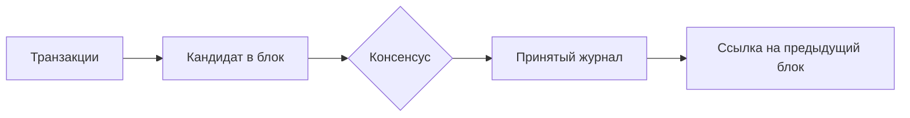

# Blockchain and Consensus

## Суть

Blockchain — реплицируемый журнал, в котором блоки связываются криптографически, а участники согласуют допустимое продолжение по протоколу консенсуса. Неизменяемость здесь операционна: переписывание истории должно потребовать нарушения правила консенсуса или контроля достаточного ресурса, а не быть математически невозможным.

## Как устроено

- Транзакции проходят локальную проверку и включаются в предлагаемый блок.
- Hash pointer связывает заголовок с предыдущим блоком и делает изменение заметным.
- Consensus определяет, кто предлагает блок, как другие узлы его принимают и когда результат считается final.
- PoW связывает право предложения с вычислительной работой; PoS — с экономической долей и правилами наказания.
- Public, private и consortium networks различаются моделью членства и доверия.

## Схема

## Практический разбор

<!-- reviewed-example:start -->
*Происхождение:* Составленный учебный пример; не экспериментальный результат курса.

**Исходные данные.** Два узла получили разные блоки на одной высоте: A и B. Правило учебной сети выбирает ветвь с большей накопленной работой.

1. Временно узел 1 хранит A, узел 2 —B.
2. Следующий блок продолжает A, её работа становится больше; узел 2 перестраивает активную цепь на ветвь A.

**Результат.** Согласование состояния произошло после разрешения временной развилки.

**Проверка.** Транзакция только из B больше не считается подтверждённой в выбранной цепи.

**Граница применимости.** Правило зависит от протокола. Число блоков не всегда равно накопленной работе; сценарий не описывает все виды консенсуса.
<!-- reviewed-example:end -->

### Дополнительное пояснение из конспекта

Систему анализируют через safety и liveness: честные узлы не должны финализировать конфликтующие состояния, а сеть должна продолжать подтверждение транзакций при допустимых отказах. Конкретные параметры и продукты из курса оставлены в source-note.

## Ограничения и безопасность

- Consensus не исправляет ошибочный smart contract или украденный signing key.
- Finality может быть вероятностной или детерминированной и должна описываться явно.
- Централизация ресурса или идентичностей меняет предположения модели.

## Связи

- [[Blockchain Cryptography]]
- [[Blockchain Attacks]]
- [[Cryptographic Hash Functions]]
- [[Digital Signatures]]

## Самопроверка

1. Какую задачу решает Блокчейн и консенсус и какие входные предпосылки для этого нужны?
2. Воспроизведите основной механизм, вычислительные шаги или поток данных без подсказки.
3. Назовите главное ограничение или ошибку применения и способ её обнаружить либо предотвратить.

## Источники курса

- [[Source - Тема №2 Блокчейн(1)]], абз. 1–121.
