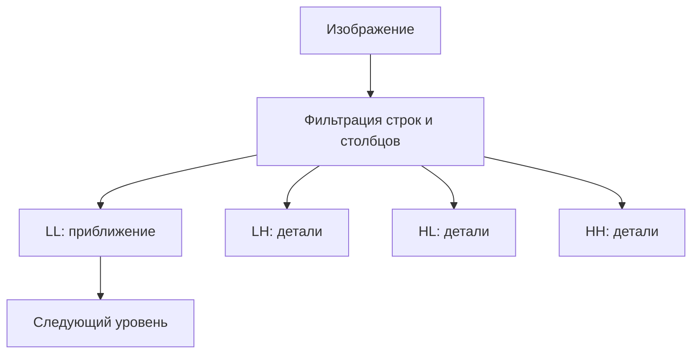

<!-- generated: crypto-stego-course -->
# Дискретное вейвлет-преобразование

## Кратко

Дискретное вейвлет-преобразование (Discrete Wavelet Transform) разделяет сигнал на низко- и высокочастотные компоненты с локализацией по положению и масштабу. Для изображения фильтрация и прореживание выполняются последовательно по двум измерениям.

## Зачем это нужно

Дискретное вейвлет-преобразование одновременно показывает положение и масштаб деталей. В отличие от глобальной гармоники Фурье, вейвлет локализован. Для изображения фильтрация по строкам и столбцам создаёт поддиапазоны приближения и деталей, которые можно рекурсивно разлагать. Подтверждающие материалы: [A Theory for Multiresolution Signal Decomposition: The Wavelet Representation](https://doi.org/10.1109/34.192463).

## Что нужно знать заранее

- [[Частотные преобразования изображений]]
- [[Основы цифровых изображений]]

## Основные понятия

| Термин | Простое объяснение |
|---|---|
| Масштабирующий фильтр | низкочастотный фильтр приближения |
| Вейвлет-фильтр | высокочастотный фильтр деталей |
| Децимация | сохранение каждого второго отсчёта |
| LL, LH, HL, HH | приближение и три направления деталей |
| Уровень | глубина рекурсивного разложения LL |

## Как это устроено

На первом уровне изображение делится на уменьшенную обзорную копию и три карты деталей. Обзор можно разложить ещё раз, получая крупные и мелкие масштабы. Поэтому изменение коэффициента привязано не только к частоте, но и к области изображения.

1. Фильтры анализа `H0` и `H1` формируют низкочастотную и высокочастотную ветви, затем данные прореживаются вдвое.
2. Повторное разложение низкочастотной части создаёт многоуровневое представление.
3. Фильтры синтеза и повышение частоты выполняют обратное преобразование.

## Формальная модель

$$
a_k=\sum_n x_nh_0[n-2k],\quad d_k=\sum_n x_nh_1[n-2k],\quad(LL,LH,HL,HH)=DWT_2(I)
$$

**Обозначения и смысл.** x_n — отсчёты сигнала, n — индекс; k — номер выходного отсчёта; h_0,h_1 — анализирующие низко-/высокочастотные фильтры; a,d — приближения и детали; I — двумерное изображение.

**Условия применения.** Это соглашение анализа через скалярные произведения сдвинутых фильтров. Для конечного сигнала нужны граничные правила. В примере — чётная длина и Хаар без дополнения; L/H означают фильтры по двум осям.

## Разобранный пример

*Происхождение:* Составленный учебный пример; не экспериментальный результат курса.

**Исходные данные.** Хаар, одна ступень, x=[4,2,6,0]. Фильтры h0=[1,1]/√2, h1=[1,−1]/√2; непересекающиеся пары.

1. Для [4,2]: a0=6/√2=3√2, d0=2/√2=√2. Для [6,0]: a1=3√2, d1=3√2.
2. Обратно первая пара: (a0+d0)/√2=4, (a0−d0)/√2=2; вторая: (a1+d1)/√2=6, (a1−d1)/√2=0.

**Результат.** Все четыре отсчёта восстановлены.

**Проверка.** Энергия входа 16+4+36=56; выход 18+2+18+18=56.

**Граница применимости.** При занулении деталей d восстановится [3,3,3,3]. Для нечётной длины нужно определить продолжение сигнала; здесь оно не требовалось.

## Схема

## Дополнительное понимание

Вейвлеты различаются длиной фильтра, гладкостью и симметрией. Haar максимально прост и хорошо показывает среднее с разностью, но создаёт грубые ступенчатые базисы. Более длинные фильтры лучше представляют гладкие области, однако расширяют область влияния одного коэффициента. Daubechies 9/7 применяется в схемах с потерями и не является тем же самым преобразованием, что целочисленная пара 5/3. Для стеганографии нельзя ограничиваться названием поддиапазона: нужно зафиксировать уровень, канал, семейство фильтров, режим границы и порядок квантования. Иначе одинаковое правило встраивания даст несовместимые результаты в разных библиотеках. Устойчивость оценивают после обратного преобразования и целевой обработки, а обнаружимость — по статистике коэффициентов и восстановленного изображения.

## Пояснение и границы применения

Анализирующий фильтр формирует низко- и высокочастотные отклики, после чего децимация уменьшает число отсчётов вдвое. Синтез сначала вставляет нули между коэффициентами, применяет согласованные фильтры и складывает ветви. Условие точного восстановления относится ко всей паре фильтров, поэтому произвольная замена одного ядра нарушает обратимость.

В двумерном изображении обозначения направлений зависят от порядка строк и столбцов. LH в одной библиотеке может называться горизонтальными деталями по типу заметных границ, а в другой — по направлению высокочастотного фильтра. Надёжнее фиксировать, какой фильтр применён по каждой оси, и визуально проверить тестовую горизонтальную и вертикальную границу.

Многоуровневая пирамида позволяет выбирать масштаб встраивания. Коэффициенты первого уровня связаны с мелкими деталями, более глубокие уровни — с крупной структурой. Изменение слишком глубокого LL может быть устойчивым, но заметным; изменение мелких HH часто исчезает после сжатия или фильтрации. Решение подтверждается измерениями после целевой цепочки обработки и обратной реконструкцией контрольного изображения без скрытых данных.

## Ограничения и типичные ошибки

- Граничная обработка и выбранные фильтры меняют коэффициенты.
- Встраивание в высокочастотные области менее заметно, но такие коэффициенты легче теряются при сглаживании или сжатии.
- Называть LL низкими частотами без указания уровня масштаба.
- Повторно разлагать все четыре поддиапазона, когда схема предполагает только LL.
- Не учитывать расширение сигнала на границах.
- Считать любой DWT целочисленно обратимым.

## Что запомнить

- DWT локализует структуру по положению и масштабу.
- Один уровень даёт LL и три направленных поддиапазона деталей.
- Выбор вейвлета и граничного режима влияет на восстановление и вложение.

## Связи

- [[Частотные преобразования изображений]]
- [[Преобразование Уолша—Адамара]]
- [[Стеганография в частотной области]]
- [[Нейросетевой стегоанализ]]

## Самопроверка

1. Какие поддиапазоны образуются после одного уровня вейвлет-разложения?
2. Как многоуровневое разложение отделяет разные масштабы изображения?
3. Как выбор поддиапазона влияет на заметность и устойчивость вложения?

> [!answer]- Ответы
> 1. Получаются LL, LH, HL и HH — приближение и горизонтальные, вертикальные, диагональные детали.
>
> 2. Повторное разложение LL строит пирамиду от мелкого масштаба к крупному.
>
> 3. LL устойчив, но заметен; детальные диапазоны менее заметны, но чувствительнее к обработке.

## Источники

### Материалы курса

- [[Source - Основы криптографии и стеганографии - Лекция 11]], стр. 45–54.

### Дополнительные источники

- [A Theory for Multiresolution Signal Decomposition: The Wavelet Representation](https://doi.org/10.1109/34.192463) — Stéphane G. Mallat, 1989; научная статья.
