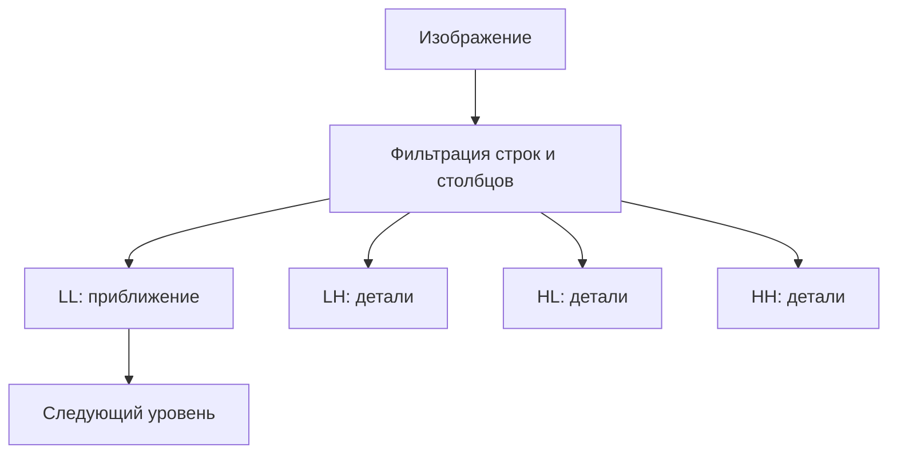

<!-- generated: crypto-stego-course -->
# Дискретное вейвлет-преобразование

## Кратко

Дискретное вейвлет-преобразование (Discrete Wavelet Transform) разделяет сигнал на низко- и высокочастотные компоненты с локализацией по положению и масштабу. Для изображения фильтрация и прореживание выполняются последовательно по двум измерениям.

## Зачем это нужно

Дискретное вейвлет-преобразование одновременно показывает положение и масштаб деталей. В отличие от глобальной гармоники Фурье, вейвлет локализован. Для изображения фильтрация по строкам и столбцам создаёт поддиапазоны приближения и деталей, которые можно рекурсивно разлагать. Подтверждающие материалы: [A Theory for Multiresolution Signal Decomposition: The Wavelet Representation](https://doi.org/10.1109/34.192463).

## Что нужно знать заранее

- [[Частотные преобразования изображений]]
- [[Основы цифровых изображений]]

## Основные понятия

| Термин | Простое объяснение |
|---|---|
| Масштабирующий фильтр | низкочастотный фильтр приближения |
| Вейвлет-фильтр | высокочастотный фильтр деталей |
| Децимация | сохранение каждого второго отсчёта |
| LL, LH, HL, HH | приближение и три направления деталей |
| Уровень | глубина рекурсивного разложения LL |

## Как это устроено

На первом уровне изображение делится на уменьшенную обзорную копию и три карты деталей. Обзор можно разложить ещё раз, получая крупные и мелкие масштабы. Поэтому изменение коэффициента привязано не только к частоте, но и к области изображения.

1. Фильтры анализа `H0` и `H1` формируют низкочастотную и высокочастотную ветви, затем данные прореживаются вдвое.
2. Повторное разложение низкочастотной части создаёт многоуровневое представление.
3. Фильтры синтеза и повышение частоты выполняют обратное преобразование.

## Формальная модель

$$
a_k=\sum_n x_nh_0[n-2k],\qquad d_k=\sum_n x_nh_1[n-2k]
$$

**Обозначения и смысл.** h и g — низко- и высокочастотные фильтры, свёртка вычисляет локальные отклики, а стрелка вниз 2 обозначает децимацию.

$$
LL,LH,HL,HH=DWT_2(I)
$$

**Обозначения и смысл.** В двумерном случае сочетания L и H по строкам и столбцам формируют четыре поддиапазона. Точное восстановление требует согласованных анализирующих и синтезирующих фильтров.

## Разобранный пример

Лекция сопоставляет Haar и Daubechies 9/7, затем показывает четыре поддиапазона двумерного преобразования и обратную сборку.

1. Взять четыре отсчёта и для Haar вычислить средние соседних пар и их разности.
2. Сохранить два коэффициента приближения и два коэффициента деталей.
3. Для изображения применить тот же принцип к строкам, затем к столбцам и получить LL, LH, HL, HH.
4. Разложить LL ещё на один уровень, не меняя уже полученные детальные поддиапазоны.
5. Выполнить синтез в обратном порядке и сравнить исходные отсчёты.

## Схема

## Дополнительное понимание

Вейвлеты различаются длиной фильтра, гладкостью и симметрией. Haar максимально прост и хорошо показывает среднее с разностью, но создаёт грубые ступенчатые базисы. Более длинные фильтры лучше представляют гладкие области, однако расширяют область влияния одного коэффициента. Daubechies 9/7 применяется в схемах с потерями и не является тем же самым преобразованием, что целочисленная пара 5/3. Для стеганографии нельзя ограничиваться названием поддиапазона: нужно зафиксировать уровень, канал, семейство фильтров, режим границы и порядок квантования. Иначе одинаковое правило встраивания даст несовместимые результаты в разных библиотеках. Устойчивость оценивают после обратного преобразования и целевой обработки, а обнаружимость — по статистике коэффициентов и восстановленного изображения.

## Пояснение и границы применения

Анализирующий фильтр формирует низко- и высокочастотные отклики, после чего децимация уменьшает число отсчётов вдвое. Синтез сначала вставляет нули между коэффициентами, применяет согласованные фильтры и складывает ветви. Условие точного восстановления относится ко всей паре фильтров, поэтому произвольная замена одного ядра нарушает обратимость.

В двумерном изображении обозначения направлений зависят от порядка строк и столбцов. LH в одной библиотеке может называться горизонтальными деталями по типу заметных границ, а в другой — по направлению высокочастотного фильтра. Надёжнее фиксировать, какой фильтр применён по каждой оси, и визуально проверить тестовую горизонтальную и вертикальную границу.

Многоуровневая пирамида позволяет выбирать масштаб встраивания. Коэффициенты первого уровня связаны с мелкими деталями, более глубокие уровни — с крупной структурой. Изменение слишком глубокого LL может быть устойчивым, но заметным; изменение мелких HH часто исчезает после сжатия или фильтрации. Решение подтверждается измерениями после целевой цепочки обработки и обратной реконструкцией контрольного изображения без скрытых данных.

## Рабочий разбор

Для практической проверки разделите систему на источник данных, преобразование, канал и решающее правило. Зафиксируйте единицы измерения, диапазоны и точность промежуточных величин. Термин «Масштабирующий фильтр» должен иметь одно операционное определение, а «Уровень» — измеримый критерий. Это не формальность: изменение округления, порядка обхода или представления данных способно дать другой результат при той же формуле.

Проведите три опыта. Первый подтверждает разобранный пример на малых данных, где все шаги можно проверить вручную. Второй меняет один параметр и показывает ожидаемый компромисс качества, устойчивости или сложности. Третий имитирует ошибку «Считать любой DWT целочисленно обратимым.» и должен завершиться контролируемым отказом либо заметным ухудшением метрики. Для каждого опыта сохраните вход, параметры, промежуточные значения и итог.

Вывод формулируйте только в границах испытания. Проверка «Явно фиксировать семейство вейвлета: Haar и Daubechies 9/7 имеют разные фильтры и свойства.» показывает, переносится ли наблюдение за пределы одного примера. Если результат меняется при новом источнике данных или другой цепочке обработки, это ограничение метода нужно записать явно, а не скрывать усреднённой оценкой.

## Мини-практика

1. Воспроизведите разобранный пример без подсказок и запишите все промежуточные значения.
2. Намеренно смоделируйте типичную ошибку: Называть LL низкими частотами без указания уровня масштаба.
3. Проверьте исправленный результат по критерию: Проверять размер каждого поддиапазона после децимации и правила обработки границ.
4. Объясните своими словами главный вывод: DWT локализует структуру по положению и масштабу.

## Ограничения и типичные ошибки

- Граничная обработка и выбранные фильтры меняют коэффициенты.
- Встраивание в высокочастотные области менее заметно, но такие коэффициенты легче теряются при сглаживании или сжатии.
- Называть LL низкими частотами без указания уровня масштаба.
- Повторно разлагать все четыре поддиапазона, когда схема предполагает только LL.
- Не учитывать расширение сигнала на границах.
- Считать любой DWT целочисленно обратимым.

## Что запомнить

- DWT локализует структуру по положению и масштабу.
- Один уровень даёт LL и три направленных поддиапазона деталей.
- Выбор вейвлета и граничного режима влияет на восстановление и вложение.

## Связи

- [[Частотные преобразования изображений]]
- [[Преобразование Уолша—Адамара]]
- [[Стеганография в частотной области]]
- [[Нейросетевой стегоанализ]]

## Самопроверка

1. Какие поддиапазоны образуются после одного уровня вейвлет-разложения?
2. Как многоуровневое разложение отделяет разные масштабы изображения?
3. Как выбор поддиапазона влияет на заметность и устойчивость вложения?

> [!answer]- Ответы
> 1. Получаются LL, LH, HL и HH — приближение и горизонтальные, вертикальные, диагональные детали.
>
> 2. Повторное разложение LL строит пирамиду от мелкого масштаба к крупному.
>
> 3. LL устойчив, но заметен; детальные диапазоны менее заметны, но чувствительнее к обработке.

## Источники

### Материалы курса

- [[Source - Основы криптографии и стеганографии - Лекция 11]], стр. 45–54.

### Дополнительные источники

- [A Theory for Multiresolution Signal Decomposition: The Wavelet Representation](https://doi.org/10.1109/34.192463) — Stéphane G. Mallat, 1989; научная статья.
