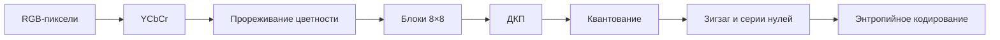

<!-- generated: crypto-stego-course -->
# Сжатие изображений в JPEG

## Кратко

JPEG в объёме курса — последовательность этапов сжатия с потерями: цвет переводится в YCbCr, цветность прореживается, блоки 8×8 проходят дискретное косинусное преобразование, коэффициенты квантуются, располагаются зигзагообразно и энтропийно кодируются.

## Зачем это нужно

JPEG нужен здесь не только как популярный формат, но и как цепочка преобразований, в которой каждое действие меняет условия встраивания. Цветовое преобразование и прореживание меняют отсчёты, ДКП переносит блок в частотные коэффициенты, а квантование необратимо округляет их. Понимание этой цепочки позволяет заранее оценить, где скрытые данные исчезнут. Подтверждающие материалы: [ITU-T Recommendation T.81 — JPEG-1](https://www.itu.int/ITU-T/recommendations/rec.aspx?lang=en&rec=2633), [Discrete Cosine Transform](https://doi.org/10.1109/T-C.1974.223784).

## Что нужно знать заранее

- [[Основы цифровых изображений]]
- [[Цветовые модели изображений]]
- [[ДПФ и ДКП для изображений]]

## Основные понятия

| Термин | Простое объяснение |
|---|---|
| Блок 8×8 | основная область пространственной обработки JPEG |
| DC-коэффициент | средний уровень блока |
| AC-коэффициенты | изменения относительно среднего |
| Квантование | деление на таблицу шагов с округлением |
| Зигзагообразный обход | порядок от низких частот к высоким |

## Как это устроено

JPEG старается тратить точность там, где зрение замечает её сильнее. Низкочастотные компоненты описывают общий тон и плавные переходы, высокочастотные — мелкие детали. После деления на таблицу квантования многие высокие частоты становятся нулями, поэтому их удобно кодировать, но нельзя точно восстановить.

1. Пиксели каждого канала группируются в блоки 8×8.
2. ДКП концентрирует значимую энергию в низких частотах; DC отражает средний уровень, остальные коэффициенты — AC.
3. Квантование делит коэффициенты на элементы таблицы и округляет результат, создавая длинные серии нулей для последующего кодирования.

## Формальная модель

$$
G_{ij}=\frac14C_iC_j\sum_{x=0}^{7}\sum_{y=0}^{7}p_{xy}\cos\frac{(2y+1)j\pi}{16}\cos\frac{(2x+1)i\pi}{16}
$$

**Обозначения и смысл.** G_{ij} — коэффициент ДКП блока, p_{xy} — центрированный отсчёт, C_i и C_j — нормирующие множители. Индексы i,j определяют горизонтальную и вертикальную частоту.

$$
\hat G_{ij}=round\!\left(\frac{G_{ij}}{Q_{ij}}\right)
$$

**Обозначения и смысл.** Q_{ij} — шаг квантования в данной позиции. Округление создаёт необратимую ошибку; при декодировании доступно только приближение Q_{ij}·hat G_{ij}.

## Разобранный пример

В блоке курса DC-коэффициент около `907.86` после квантования становится `57`, а большинство высокочастотных AC-коэффициентов обращается в ноль.

1. Перевести RGB в YCbCr и при выбранном режиме уменьшить разрешение Cb и Cr.
2. Разделить канал на блоки 8×8, вычесть смещение уровня и вычислить двумерную ДКП.
3. Разделить каждый коэффициент на соответствующий элемент таблицы Q и округлить.
4. Записать DC как разность с предыдущим блоком, AC пройти зигзагообразно и закодировать серии нулей.
5. При декодировании выполнить действия в обратном порядке, понимая, что округлённая информация уже потеряна.

## Иллюстрации из курса

![[90 Attachments/Courses/Основы криптографии и стеганографии/OCS - JPEG Pipeline - L12 p09.png]]

*Что смотреть:* последовательность RGB→YCbCr, прореживание, ДКП, квантование, зигзагообразный обход и кодирование. *Источник:* [[Source - Основы криптографии и стеганографии - Лекция 12]], стр. 9.

## Схема

## Дополнительное понимание

Кодированный JPEG-поток не является простой таблицей коэффициентов. Перед значениями находятся маркеры, таблицы Хаффмана и квантования, параметры компонентов и режимы выборки. DC-коэффициенты обычно кодируются разностями между соседними блоками, а AC — парами длина серии нулей и размер следующего значения. Поэтому безопасное исследование работает через JPEG-декодер, который предоставляет коэффициенты без лишнего пространственного пересчёта. При повторном сохранении из пикселей блоки проходят ДКП и квантование заново: даже визуально одинаковое изображение может иметь другое распределение коэффициентов. Для оценки вложения важны три уровня: искажение пикселей, изменение коэффициентов и декодируемость скрытых битов. Один высокий PSNR не гарантирует низкую обнаружимость, а успешное извлечение сразу после записи не доказывает устойчивость к следующей обработке.

## Пояснение и границы применения

После квантования коэффициенты проходят подготовку к компактной записи. DC хранится как разность относительно предыдущего блока компоненты, потому что средние уровни соседних блоков часто близки. AC располагаются зигзагообразно: вероятные ненулевые низкие частоты идут раньше, а длинный хвост нулей описывается короткими кодами серий. Затем категории величин и дополнительные биты кодируются таблицами Хаффмана. Этот этап без потерь относительно уже квантованных чисел.

При декодировании восстанавливаются квантованные коэффициенты, умножаются на Q и проходят обратную ДКП. Полученные отсчёты округляются и ограничиваются диапазоном. Цветность увеличивается до размера яркости, затем выполняется обратный переход в RGB. Каждый из этих шагов может внести отличие, поэтому «качество 90» не является точным математическим параметром между программами.

Для стеганографии есть два режима сохранения. Коэффициентный редактор меняет целые квантованные значения и пересобирает поток; обычный графический редактор сначала декодирует пиксели, а затем выполняет всю цепочку заново. Второй режим значительно разрушительнее. Карточка должна помогать сразу определить, какой канал ожидается в реальном использовании.

## Рабочий разбор

Для практической проверки разделите систему на источник данных, преобразование, канал и решающее правило. Зафиксируйте единицы измерения, диапазоны и точность промежуточных величин. Термин «Блок 8×8» должен иметь одно операционное определение, а «Зигзагообразный обход» — измеримый критерий. Это не формальность: изменение округления, порядка обхода или представления данных способно дать другой результат при той же формуле.

Проведите три опыта. Первый подтверждает разобранный пример на малых данных, где все шаги можно проверить вручную. Второй меняет один параметр и показывает ожидаемый компромисс качества, устойчивости или сложности. Третий имитирует ошибку «Сравнивать JPEG-файлы по байтам вместо декодированных данных и параметров кодирования.» и должен завершиться контролируемым отказом либо заметным ухудшением метрики. Для каждого опыта сохраните вход, параметры, промежуточные значения и итог.

Вывод формулируйте только в границах испытания. Проверка «Для стеганографии проводить полный цикл сохранение–открытие–повторное сохранение, а не тестировать только изменённый массив коэффициентов.» показывает, переносится ли наблюдение за пределы одного примера. Если результат меняется при новом источнике данных или другой цепочке обработки, это ограничение метода нужно записать явно, а не скрывать усреднённой оценкой.

## Мини-практика

1. Воспроизведите разобранный пример без подсказок и запишите все промежуточные значения.
2. Намеренно смоделируйте типичную ошибку: Называть ДКП причиной потерь: при достаточной точности само преобразование обратимо, потери создаёт квантование и округление.
3. Проверьте исправленный результат по критерию: На учебном блоке отдельно сравнить коэффициенты до квантования, после квантования и после обратного преобразования.
4. Объясните своими словами главный вывод: JPEG — последовательность цветового, частотного и энтропийного кодирования.

## Ограничения и типичные ошибки

- Квантование необратимо; повторное сохранение в JPEG добавляет новые ошибки.
- Скрытые изменения коэффициентов ДКП должны учитывать нули, значения ±1, таблицы квантования и повторное кодирование.
- Называть ДКП причиной потерь: при достаточной точности само преобразование обратимо, потери создаёт квантование и округление.
- Встраивать данные в нулевые высокочастотные коэффициенты, которые кодек снова обнулит.
- Игнорировать границы блоков и различие DC/AC.
- Сравнивать JPEG-файлы по байтам вместо декодированных данных и параметров кодирования.

## Что запомнить

- JPEG — последовательность цветового, частотного и энтропийного кодирования.
- Главный необратимый этап базового JPEG — квантование.
- Стойкость вложения проверяется после реального повторного кодирования.

## Связи

- [[Цветовые модели изображений]]
- [[ДПФ и ДКП для изображений]]
- [[Стеганография в JPEG]]
- [[Стеганография в частотной области]]

## Самопроверка

1. Из каких основных этапов состоит JPEG-сжатие?
2. На каком этапе JPEG необратимо теряет информацию?
3. Почему повторное JPEG-кодирование опасно для скрытого сообщения?

> [!answer]- Ответы
> 1. Цепочка включает RGB→YCbCr, субдискретизацию, блоки 8×8, ДКП, квантование, зигзаг и энтропийное кодирование.
>
> 2. Информация необратимо теряется прежде всего при округлении после деления на таблицу квантования.
>
> 3. Новые таблицы, округление и субдискретизация могут изменить коэффициенты, несущие сообщение.

## Источники

### Материалы курса

- [[Source - Основы криптографии и стеганографии - Лекция 12]], стр. 8–18.

### Дополнительные источники

- [ITU-T Recommendation T.81 — JPEG-1](https://www.itu.int/ITU-T/recommendations/rec.aspx?lang=en&rec=2633) — ITU-T and ISO/IEC, 1992; официальный стандарт.
- [Discrete Cosine Transform](https://doi.org/10.1109/T-C.1974.223784) — Nasir Ahmed, T. Natarajan, K. R. Rao, 1974; научная статья.
