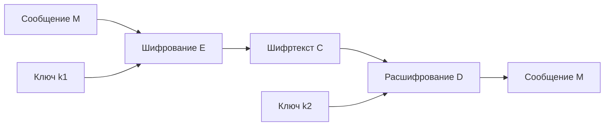

# Cryptosystem and Security Goals

## Суть

Криптосистема задаёт множества сообщений, шифротекстов и ключей, а также согласованные алгоритмы преобразования. Корректность требует, чтобы расшифрование сообщения на совместимом ключе возвращало исходный открытый текст. Безопасность описывается не названием алгоритма, а свойствами, моделью противника и условиями применения.

## Как устроено

- Конфиденциальность скрывает содержание; целостность обнаруживает изменение; аутентичность связывает данные с источником; неотказуемость достигается только в более широкой системе доказательств.
- Симметричная схема использует общий секрет, асимметричная — связанную пару открытого и закрытого ключей.
- Вероятностные алгоритмы включают nonce, IV или случайные значения, поэтому один и тот же текст не обязан давать один шифротекст.
- Схема безопасности охватывает генерацию ключей, алгоритмы, параметры, формат данных и правила проверки.

## Ключевая формула

Функциональная корректность шифрования требует $$D_{k_2}(E_{k_1}(M))=M,$$ где в симметричной схеме обычно $k_1=k_2$, а в асимметричной используются разные ключи пары.

<!-- reviewed-notation:start -->
**Обозначения и условия.** M — допустимое сообщение; E и D — согласованные преобразования; k_1 и k_2 — ключи одной схемы. Криптографическая корректность означает восстановление M при штатном вводе; она сама по себе не доказывает целостность, аутентичность или доступность.
<!-- reviewed-notation:end -->

## Схема

## Практический разбор

<!-- reviewed-example:start -->
*Происхождение:* Составленный учебный пример; не экспериментальный результат курса.

**Исходные данные.** Алиса передаёт Бобу один бит команды M=0; общий учебный ключ K=1; C=M XOR K. Противник может менять передаваемый бит.

1. Алиса получает C=1. Боб без вмешательства расшифровывает 1 XOR 1=0.
2. Противник инвертирует C на 0; Боб получает 0 XOR 1=1 и не замечает изменения по одному шифрованию.

**Результат.** Корректное шифрование восстановило сообщение, но не обеспечило целостность при активном вмешательстве.

**Проверка.** Оба возможных сообщения восстанавливаются своим ключом, однако модификация шифртекста меняет команду.

**Граница применимости.** Это учебный XOR, не прикладная схема. Для защиты от изменения нужна аутентификация, а для доступности — отдельные меры.
<!-- reviewed-example:end -->

## Ограничения и безопасность

- Шифрование без проверки целостности не гарантирует, что расшифрованные данные не были изменены.
- Корректный примитив может стать небезопасным из-за повторного nonce, слабой энтропии, неверного режима или утечки ключа.

## Связи

- [[Symmetric-Key Cryptography]]
- [[Asymmetric Cryptography]]
- [[Message Authentication Codes]]
- [[Digital Signatures]]
- [[Cryptographic Protocols and Authenticated Key Exchange]]

## Самопроверка

1. Какую задачу решает Криптосистема и цели безопасности и какие входные предпосылки для этого нужны?
2. Воспроизведите основной механизм, вычислительные шаги или поток данных без подсказки.
3. Назовите главное ограничение или ошибку применения и способ её обнаружить либо предотвратить.

## Источники курса

- [[Source - 2024_Лекция 01]], стр. 5–15.
- [[Source - Тема №1 Введение(1)]], абз. 14–173.

<!-- crypto-stego-course:start -->
## Дополнение из курса «Основы криптографии и стеганографии»

Материал связывает криптографические преобразования с разными задачами защиты: шифрование обеспечивает конфиденциальность, хеш-функция помогает обнаружить случайные изменения, код аутентификации сообщения (MAC) подтверждает целостность и знание общего секрета, а цифровая подпись позволяет проверить автора и защищает от отказа от авторства. Эти механизмы не заменяют друг друга.

- [[Source - Основы криптографии и стеганографии - Лекция 01]], стр. 8–19.
<!-- crypto-stego-course:end -->
