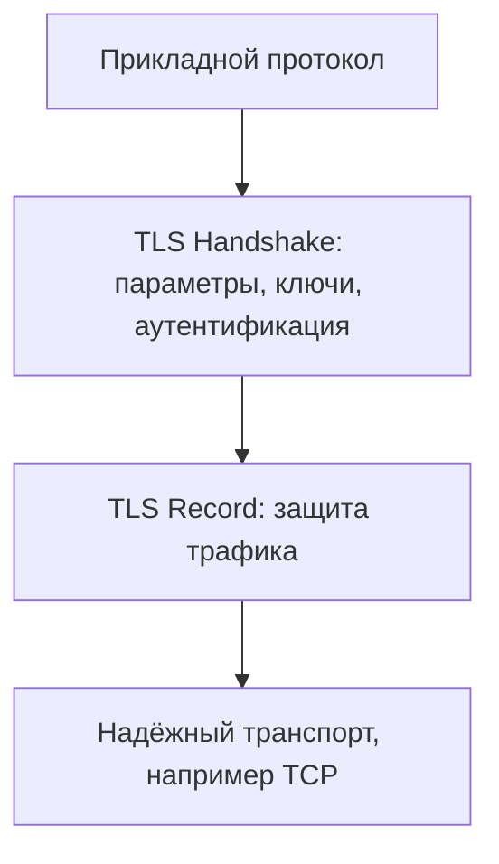

# TLS

## Суть

Transport Layer Security (TLS) защищает обмен между приложениями поверх надёжного транспорта, например TCP. Курс выделяет три задачи: конфиденциальность, обнаружение подмены и аутентификацию узлов. Наиболее распространённое применение — HTTPS.

## Как устроено

- Handshake согласует параметры безопасности, формирует общий ключевой материал и выполняет аутентификацию сторон.
- Клиент предлагает поддерживаемые наборы алгоритмов, а сервер выбирает шифр и хэш-функцию или алгоритм имитозащиты.
- Аутентификация может быть односторонней или двусторонней; цифровой сертификат связывает имя стороны с открытым ключом через доверие к удостоверяющему центру.
- Сеансовый секрет в материале курса получают передачей защищённого случайного значения, обменом Диффи — Хеллмана либо из заранее распределённого секрета.
- Record использует согласованные параметры для защиты трафика и разбивает сообщения верхнего уровня на записи.

## Схема

## Практический разбор

<!-- reviewed-example:start -->
*Происхождение:* Составленный учебный пример; не экспериментальный результат курса.

**Исходные данные.** Клиент открывает kb.example; посредник предъявляет сертификат для other.example с корректной доверенной цепочкой.

1. Проверка цепочки подписей проходит.
2. Проверка имени обнаруживает несоответствие other.example ожидаемому kb.example; соединение не допускается к передаче прикладных данных.

**Результат.** Доверенный издатель сам по себе не делает сертификат подходящим этому серверу.

**Проверка.** Контрольная попытка с сертификатом kb.example проходит проверку имени при остальных выполненных условиях.

**Граница применимости.** Сценарий иллюстрирует одно условие аутентификации, не полный TLS handshake и не настройку реального сервера.
<!-- reviewed-example:end -->

## Ограничения и безопасность

- Если сертификат не проверяется, шифрование не предотвращает подмену стороны активным посредником.
- Набор алгоритмов должен обеспечивать и шифрование, и имитозащиту; согласованный ключевой материал нельзя повторно использовать вне предусмотренного сеанса.
- Указание курса о рекомендуемых версиях TLS относится к состоянию DOCX, созданного в апреле 2025 года, и перед эксплуатационным решением требует актуализации.

## Связи

- [[Public Key Infrastructure and X.509]]
- [[Cryptographic Protocols and Authenticated Key Exchange]]
- [[Man-in-the-Middle Attack]]

## Самопроверка

1. Какую задачу решает Transport Layer Security и какие входные предпосылки для этого нужны?
2. Воспроизведите основной механизм, вычислительные шаги или поток данных без подсказки.
3. Назовите главное ограничение или ошибку применения и способ её обнаружить либо предотвратить.

## Источники курса

- [[Source - Тема №5 Протоколы(1)]], абз. 408–431.
- [[Source - Тема №6 Классы СКЗИ(1)]], абз. 67–118.
