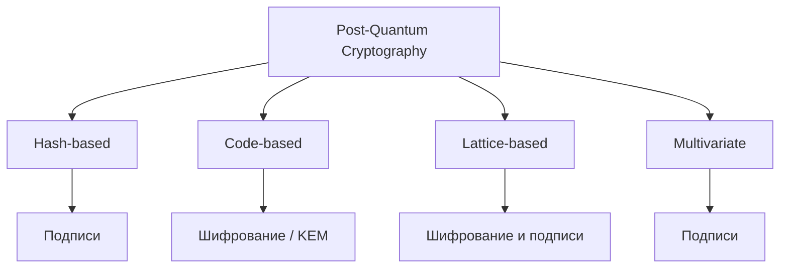

# Post-Quantum Cryptography

## Суть

Post-Quantum Cryptography (PQC) разрабатывает классические алгоритмы, рассчитанные на противника с крупномасштабным квантовым компьютером. Она отличается от QKD: выполняется на обычных вычислителях и заменяет уязвимые public-key primitives, а не физический канал распределения ключа.

## Как устроено

- Алгоритм Шора угрожает факторизации и дискретному логарифму, следовательно RSA, DH и ECC.
- Алгоритм Гровера даёт квадратичное ускорение поиска и влияет на запас длины симметричных ключей и хэшей.
- Основные семейства курса: hash-based signatures, code-based, lattice-based и multivariate cryptography.
- Миграция может применять hybrid key establishment или подпись, соединяя классический и PQC-компонент.
- Crypto agility требует версии форматов, negotiation и возможности ротации без изменения данных вручную.

## Схема

## Практический разбор

<!-- reviewed-example:start -->
*Происхождение:* Составленный учебный пример; не экспериментальный результат курса.

**Исходные данные.** Система использует классический обмен ключами и классическую подпись. Требуется оценить замену обмена на постквантовый KEM.

1. Разделить назначение механизмов: KEM получает общий секрет, подпись подтверждает сообщения.
2. Проверить, как новый общий секрет включается в существующий протокол и чем аутентифицируется обмен.
3. Отдельно оценить подпись: замена KEM не сделала её автоматически постквантовой.

**Результат.** Получен перечень двух независимых миграционных задач, а не одна замена названия алгоритма.

**Проверка.** В схеме явно остались два поля: механизм согласования секрета и механизм аутентификации.

**Граница применимости.** Конкретные статусы стандартов и выбор параметров требуют актуальной проверки; эта карточка не объявляет старые результаты курса современным рейтингом.
<!-- reviewed-example:end -->

### Дополнительное пояснение из конспекта

Инвентаризация начинается с долгоживущих данных и public-key зависимостей: сертификаты, VPN, firmware signing, архивные подписи и протоколы. Затем оценивается риск harvest-now-decrypt-later и возможность гибридного перехода.

## Ограничения и безопасность

- Статусы стандартов, наборы параметров и рекомендации быстро меняются; эта заметка отражает DOCX, созданный в апреле 2025 года, и требует актуализации перед внедрением.
- Большие ключи и ciphertext/signature меняют MTU, storage, latency и parser attack surface.
- Новая математическая основа не устраняет implementation и side-channel risks.

## Связи

- [[Quantum Computing for Cryptography]]
- [[Hash-Based Signatures]]
- [[Code-Based Cryptography]]
- [[Lattice-Based Cryptography]]
- [[Multivariate Cryptography]]
- [[Quantum Key Distribution]]

## Самопроверка

1. Какую задачу решает Постквантовая криптография и какие входные предпосылки для этого нужны?
2. Воспроизведите основной механизм, вычислительные шаги или поток данных без подсказки.
3. Назовите главное ограничение или ошибку применения и способ её обнаружить либо предотвратить.

## Источники курса

- [[Source - Тема №7 Постквантовая криптография(1)]], абз. 1–170; временные сведения — срез на дату DOCX в апреле 2025 года.
