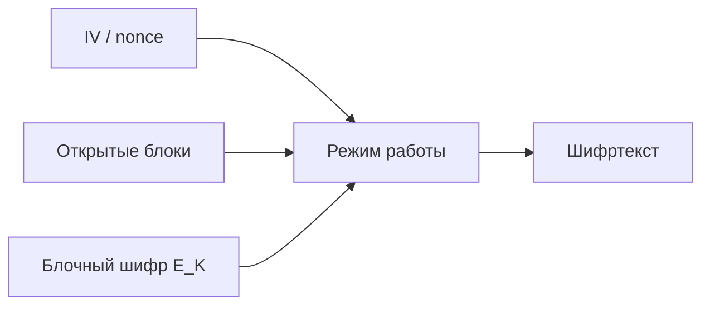

# Block Cipher Modes

## Суть

Режим работы определяет, как блочный шифр обрабатывает сообщение произвольной длины. Он задаёт связь блоков, требования к синхропосылке, возможность параллелизма, распространение ошибок и необходимость padding; один и тот же примитив в разных режимах имеет разный контракт безопасности.

## Как устроено

- ECB шифрует блоки независимо и раскрывает повторяющуюся структуру.
- CBC связывает блок с предыдущим шифротекстом и требует непредсказуемый IV; ошибка влияет на текущий и следующий блок.
- CTR превращает шифр в генератор гаммы и требует уникальную пару key–counter.
- OFB и CFB создают обратную связь по гамме или шифротексту.
- Режим имитовставки использует последовательное преобразование блоков для тега, но не шифрует данные.

## Ключевая формула

Для CBC связь блоков задаётся как $$C_i=E_K(P_i\oplus C_{i-1}),\qquad P_i=D_K(C_i)\oplus C_{i-1},\quad C_0=IV.$$ В режиме счётчика поток получают как $O_i=E_K(CTR_i)$, а $C_i=P_i\oplus O_i$.

## Схема

## Практический разбор

Выбор режима начинают с нужных свойств. Для конфиденциальности и целостности предпочтителен единый authenticated-encryption contract; при использовании раздельных схем необходимо точно задать порядок шифрования и MAC.

## Ограничения и безопасность

- Повтор nonce в CTR повторяет гамму и раскрывает XOR открытых текстов.
- Повтор или предсказуемость IV опасны не одинаково во всех режимах — требования читаются как часть конкретного режима.
- Padding oracle возникает, если ошибки дополнения наблюдаемы до аутентификации.

## Связи

- [[Symmetric-Key Cryptography]]
- [[Message Authentication Codes]]
- [[GOST R 34.13-2015]]
- [[Advanced Encryption Standard]]

## Самопроверка

1. Какую задачу решает Режимы работы блочных шифров и какие входные предпосылки для этого нужны?
2. Воспроизведите основной механизм, вычислительные шаги или поток данных без подсказки.
3. Назовите главное ограничение или ошибку применения и способ её обнаружить либо предотвратить.

## Источники курса

- [[Source - 2024_Лекция 15]], стр. 1–12.
- [[Source - ГОСТ Р 34.13-2015]], стр. 1–42.
- [[Source - Тема №3 Алгоритмы(1)]], абз. 96–139.
