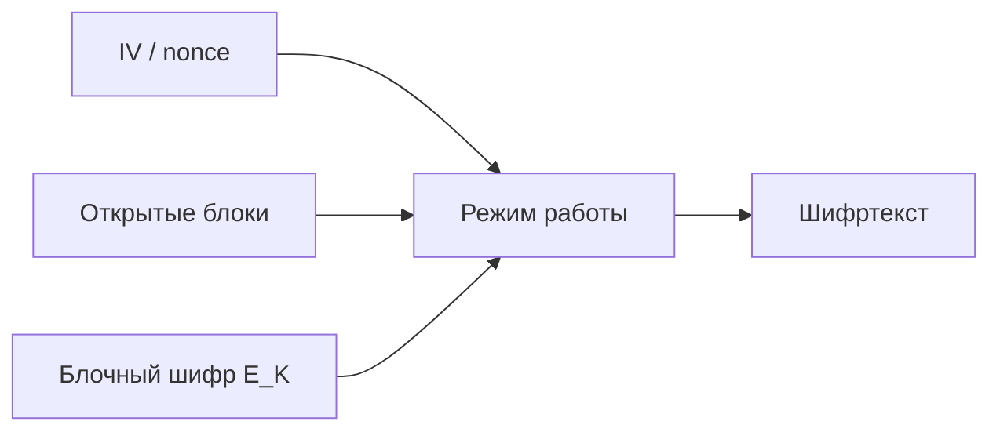

# Block Cipher Modes

## Суть

Режим работы определяет, как блочный шифр обрабатывает сообщение произвольной длины. Он задаёт связь блоков, требования к синхропосылке, возможность параллелизма, распространение ошибок и необходимость padding; один и тот же примитив в разных режимах имеет разный контракт безопасности.

## Как устроено

- ECB шифрует блоки независимо и раскрывает повторяющуюся структуру.
- CBC связывает блок с предыдущим шифротекстом и требует непредсказуемый IV; ошибка влияет на текущий и следующий блок.
- CTR превращает шифр в генератор гаммы и требует уникальную пару key–counter.
- OFB и CFB создают обратную связь по гамме или шифротексту.
- Режим имитовставки использует последовательное преобразование блоков для тега, но не шифрует данные.

## Ключевая формула

Для CBC связь блоков задаётся как $$C_i=E_K(P_i\oplus C_{i-1}),\qquad P_i=D_K(C_i)\oplus C_{i-1},\quad C_0=IV.$$ В режиме счётчика поток получают как $O_i=E_K(CTR_i)$, а $C_i=P_i\oplus O_i$.

<!-- reviewed-notation:start -->
**Обозначения и условия.** P_i и C_i — открытый и зашифрованный n-битные блоки, i≥1; K — ключ; XOR действует побитно; IV — начальный n-битный блок. CBC требует полных блоков и правил дополнения. Для CTR значение CTR_i — n-битный вход шифра с заданным кодированием nonce и счётчика; оно не должно повторяться под тем же K. Здесь не задаются порядок байтов счётчика и формат nonce — без профиля их нельзя угадать.
<!-- reviewed-notation:end -->

## Схема

## Иллюстрация из курса

![[90 Attachments/Cryptography/Course Visuals/GCM - Authenticated Encryption Layout - Topic 3 p158-159.png]]

*Что смотреть:* GCM одновременно выдаёт ciphertext и authentication tag; header и sequence number показаны как дополнительные аутентифицируемые данные. *Источник:* [[Source - Тема №3 Алгоритмы(1)]], абз. 158–159, embedded media `image6.png`.

## Практический разбор

<!-- reviewed-example:start -->
*Происхождение:* Составленный учебный пример; не экспериментальный результат курса.

**Исходные данные.** Учебный 4-битный блочный примитив E(x)=x XOR 9, D=E; CBC, IV=3, блоки P1=5,P2=6.

1. C1=E(5 XOR 3)=E(6)=15.
2. C2=E(6 XOR 15)=E(9)=0.
3. Назад P1=D(15) XOR 3=6 XOR 3=5; P2=D(0) XOR 15=9 XOR 15=6.

**Результат.** CBC дал блоки [15,0], обратная цепочка вернула [5,6].

**Проверка.** Если ошибочно заменить IV=3 на IV=2, первый восстановленный блок станет 4, второй останется 6.

**Граница применимости.** Игрушечный E нестоек; CBC сам по себе не проверяет целостность. Паддинг не нужен только потому, что вход уже разбит на полные блоки.
<!-- reviewed-example:end -->

### Дополнительное пояснение из конспекта

Выбор режима начинают с нужных свойств. Для конфиденциальности и целостности предпочтителен единый authenticated-encryption contract; при использовании раздельных схем необходимо точно задать порядок шифрования и MAC.

## Ограничения и безопасность

- Повтор nonce в CTR повторяет гамму и раскрывает XOR открытых текстов.
- Повтор или предсказуемость IV опасны не одинаково во всех режимах — требования читаются как часть конкретного режима.
- Padding oracle возникает, если ошибки дополнения наблюдаемы до аутентификации.

## Связи

- [[Symmetric-Key Cryptography]]
- [[Message Authentication Codes]]
- [[GOST R 34.13-2015]]
- [[Advanced Encryption Standard]]

## Самопроверка

1. Какую задачу решает Режимы работы блочных шифров и какие входные предпосылки для этого нужны?
2. Воспроизведите основной механизм, вычислительные шаги или поток данных без подсказки.
3. Назовите главное ограничение или ошибку применения и способ её обнаружить либо предотвратить.

## Источники курса

- [[Source - 2024_Лекция 15]], стр. 1–12.
- [[Source - ГОСТ Р 34.13-2015]], стр. 1–42.
- [[Source - Тема №3 Алгоритмы(1)]], абз. 96–139.
