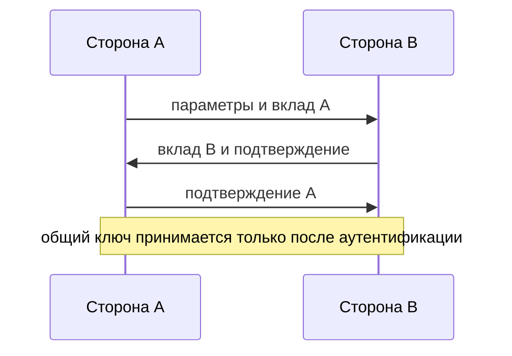

# Cryptographic Protocols and Authenticated Key Exchange

## Суть

Криптографический протокол определяет последовательность сообщений, состояния сторон и свойства, которые должны сохраниться при активном противнике. Authenticated Key Exchange (AKE) одновременно получает свежий общий секрет и связывает его с ожидаемыми участниками и транскриптом.

## Как устроено

- Протокол фиксирует роли, идентичности, nonces, ephemeral public keys и точное кодирование сообщений.
- Key confirmation доказывает, что другая сторона получила тот же ключ, но не заменяет аутентификацию личности.
- Транскрипт подписывается или аутентифицируется целиком, чтобы downgrade и перестановка сообщений меняли проверяемое значение.
- Выработанный общий секрет превращается в предусмотренный протоколом сеансовый ключ и связывается с текущим сеансом.
- State machine отвергает неожиданные, повторные и неполные переходы.

## Схема

## Практический разбор

<!-- reviewed-example:start -->
*Происхождение:* Составленный учебный пример; не экспериментальный результат курса.

**Исходные данные.** Алиса и Боб согласуют эфемерные ключи, но активный посредник может заменять сообщения.

1. Связать публичные значения обмена, идентификаторы сторон и выбранные алгоритмы в один транскрипт.
2. Проверить аутентификацию этого транскрипта и подтверждение полученного ключа до передачи прикладной команды.

**Результат.** При подмене публичного значения транскрипты расходятся и проверка должна завершиться отказом.

**Проверка.** Успешное вычисление общего числа без проверки транскрипта не считается завершённым аутентифицированным обменом.

**Граница применимости.** Это критерии сценария, не новый самодельный протокол. Для эксплуатации выбирается готовый проверенный протокол.
<!-- reviewed-example:end -->

### Дополнительное пояснение из конспекта

Простой Diffie–Hellman становится AKE только после аутентификации публичных значений и ролей. Разбор атакующего посредника показывает, почему проверка одного сертификата без привязки к транскрипту может быть недостаточной.

## Ограничения и безопасность

- Свежесть nonce не гарантирует его секретность, но повтор может допустить replay.
- Неоднозначная сериализация создаёт разные интерпретации подписанного транскрипта.
- Согласование алгоритмов должно быть включено в аутентифицированный контекст.

## Связи

- [[Diffie-Hellman Key Exchange]]
- [[Man-in-the-Middle Attack]]
- [[TLS]]
- [[IPsec]]
- [[SSH]]

## Самопроверка

1. Какую задачу решает Криптографические протоколы и аутентифицированный обмен ключами и какие входные предпосылки для этого нужны?
2. Воспроизведите основной механизм, вычислительные шаги или поток данных без подсказки.
3. Назовите главное ограничение или ошибку применения и способ её обнаружить либо предотвратить.

## Источники курса

- [[Source - Тема №5 Протоколы(1)]], абз. 1–104 и 259–312.
- [[Source - Тема №1 Введение(1)]], абз. 612–678.
