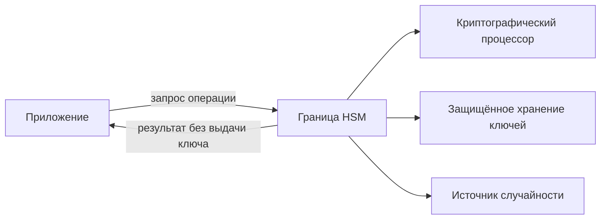

# Hardware Security Modules

## Суть

Hardware Security Module (HSM) — специализированная доверенная граница для генерации, хранения и применения ключей. Приложение передаёт данные или параметры операции, а private key остаётся внутри модуля; контроль политики, аутентификация операторов и tamper response дополняют криптографию.

## Как устроено

- Secure key storage защищает ключи в энергонезависимой памяти или под wrapping key.
- Модуль выполняет sign, decrypt, MAC, derive и random generation согласно разрешённым атрибутам ключа.
- Разделение ролей и quorum уменьшают риск единоличного административного доступа.
- Backup и cluster replication переносят ключ только в обёрнутом виде между совместимыми trust boundaries.
- Audit log фиксирует команды, результат и субъект без раскрытия ключевого материала.

## Схема

## Практический разбор

<!-- reviewed-example:start -->
*Происхождение:* Составленный учебный пример; не экспериментальный результат курса.

**Исходные данные.** Сервис должен подписывать документы; ключ создан внутри HSM и помечен неэкспортируемым.

1. Приложение передаёт запрос подписи через разрешённый интерфейс; HSM проверяет право операции и возвращает подпись, не закрытый ключ.
2. Проверяющий вне HSM проверяет подпись открытым ключом. Попытка экспорта секретного материала по политике отвергается.

**Результат.** Приложение получает результат операции без извлечения ключа.

**Проверка.** Проверяются два разных свойства: подпись валидна и экспорт запрещён. Одно не доказывает другое.

**Граница применимости.** Компрометированное авторизованное приложение может запрашивать нежелательные подписи. Неэкспортируемость не заменяет контроль смысла операций.
<!-- reviewed-example:end -->

### Дополнительное пояснение из конспекта

Интеграцию проектируют от отказов: доступность кластера, восстановление после потери устройства, ротация wrapping keys, лимиты производительности и поведение приложения при недоступности HSM.

## Ограничения и безопасность

- HSM не защищает от разрешённой, но злонамеренной команды приложения.
- Экспортируемый ключ снижает ценность аппаратной границы.
- Ошибки firmware, side-channel и supply chain остаются частью модели угроз.

## Связи

- [[Cryptographic Key Management]]
- [[Cryptographic Service Providers]]
- [[Cryptographic Protection Systems]]
- [[Side-Channel Attacks]]

## Самопроверка

1. Какую задачу решает Аппаратные модули безопасности и какие входные предпосылки для этого нужны?
2. Воспроизведите основной механизм, вычислительные шаги или поток данных без подсказки.
3. Назовите главное ограничение или ошибку применения и способ её обнаружить либо предотвратить.

## Источники курса

- [[Source - Тема №6 Классы СКЗИ(1)]], абз. 1–66.
