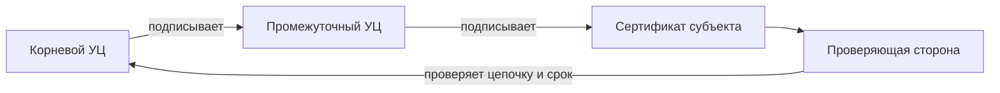

# Public Key Infrastructure and X.509

## Суть

Public Key Infrastructure (PKI) связывает идентичность и public key через сертификаты и доверенные удостоверяющие центры. X.509 задаёт структуру сертификата: subject, issuer, serial number, срок действия, public key, расширения и подпись издателя.

## Как устроено

- Root CA служит trust anchor; intermediate CA ограничивают повседневное использование корневого ключа.
- Проверка строит цепочку до доверенного корня и валидирует подписи, время, ограничения CA и назначение ключа.
- Subject Alternative Name задаёт имена, для которых сертификат действителен.
- Отзыв распространяется через CRL или online status protocol, но политика клиента определяет реакцию на недоступность статуса.

## Схема

## Практический разбор

Сертификат решает задачу аутентичности ключа только при корректной проверке контекста. Для TLS недостаточно валидной подписи CA: имя сервера должно совпадать, цепочка — соответствовать политике, а сертификат — разрешать нужное применение.

## Ограничения и безопасность

- Скомпрометированный CA или ошибочная выдача расширяют доверие атакующему.
- Истечение и отзыв — разные события; старый сертификат не становится отозванным автоматически.
- Pinning и private PKI требуют собственного плана ротации и восстановления.

## Связи

- [[Certificate Enrollment Protocols]]
- [[TLS]]
- [[Digital Signatures]]
- [[Cryptographic Key Management]]
- [[Man-in-the-Middle Attack]]

## Самопроверка

1. Какую задачу решает Инфраструктура открытых ключей и X.509 и какие входные предпосылки для этого нужны?
2. Воспроизведите основной механизм, вычислительные шаги или поток данных без подсказки.
3. Назовите главное ограничение или ошибку применения и способ её обнаружить либо предотвратить.

## Источники курса

- [[Source - 2024_Лекция 22]], стр. 1–9.
- [[Source - Тема №5 Протоколы(1)]], абз. 313–344 и 447–478.
- [[Source - Тема №2 Блокчейн(1)]], абз. 321–338.
