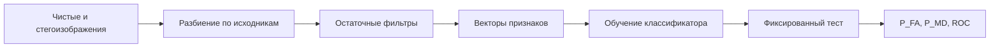

<!-- generated: crypto-stego-course -->
# Машинное обучение в стегоанализе

## Кратко

Машинное обучение в стегоанализе (Machine Learning for Steganalysis) рассматривает обнаружение как задачу классификации по статистическим признакам изображения. В классической схеме признаки вычисляются отдельно, а затем используются для обучения k-NN, наивного байесовского классификатора, SVM, логистической регрессии или другой модели.

## Где применяется

Машинное обучение в классическом стегоанализе отделяет построение признаков от классификации. Исследователь сначала вычисляет остатки и совместные статистики, затем обучает модель различать чистые и изменённые изображения. Такая схема интерпретируемее глубокой сети, но качество ограничено выбранным пространством признаков. Подтверждающие материалы: [Rich Models for Steganalysis of Digital Images](https://doi.org/10.1109/TIFS.2012.2190402), [Detecting LSB Steganography in Color and Gray-Scale Images](https://doi.org/10.1109/93.959097).

## Что нужно знать заранее

- [[Статистический стегоанализ]]
- [[Стегоанализ]]
- [[Основы цифровых изображений]]

## Входные данные и результат

Содержание изображения намного сильнее слабого стегосигнала. Высокочастотные фильтры убирают часть содержания, а статистики остатков собирают небольшие систематические отклонения. Классификатор объединяет множество слабых признаков в одно решение.

### Основные понятия

| Термин | Простое объяснение |
|---|---|
| Вектор признаков | числовое описание статистики изображения |
| Остаток | результат подавления предсказуемого содержимого фильтром |
| Классификатор | модель, переводящая признаки в оценку класса |
| Обучение, валидация и тест | раздельные наборы обучения, настройки и итоговой проверки |
| Несовпадение источников | различие контейнеров при обучении и применении |

## Пошаговый алгоритм

1. Из чистых и стегоизображений строятся сопоставимые обучающие выборки.
2. Для каждого объекта вычисляется вектор пространственных или JPEG-признаков.
3. Классификатор обучается и проверяется на независимой выборке из того же операционного распределения.

## Формулы и обозначения

$$
\hat y=\arg\max_y P(y)\prod_iP(x_i\mid y),\qquad\hat y_{kNN}=\operatorname{mode}\{y_j:j\in N_k(x)\}
$$

**Обозначения и смысл.** x — вектор признаков, i — компонент; y∈{чисто,стего}; P(y) — априорная вероятность. N_k(x) — k≥1 ближайших обучающих векторов, y_j — их метки; mode — большинство.

**Условия применения.** Наивный Байес предполагает условную независимость признаков. Для k-NN нужны фиксированные масштаб, метрика расстояния и правило ничьей; примеры ниже показывают разные модели, не одну составную формулу.

## Разбор примера

*Происхождение:* Составленный учебный пример; не экспериментальный результат курса.

**Исходные данные.** Два бинарных признака x1=x2=1. Априорные вероятности классов 0.5; для чистых P(x1=1)=0.2,P(x2=1)=0.3, для стего — 0.8 и 0.6.

1. Наивный Байес: оценка чистого 0.5·0.2·0.3=0.03; стего 0.5·0.8·0.6=0.24.
2. Нормировать: P(стего|x)=0.24/(0.03+0.24)=8/9≈0.8889 при предположениях модели.
3. Отдельный k-NN: точки 0.1(чисто),0.4(стего),0.6(стего), запрос 0.5,k=3. Расстояния 0.4,0.1,0.1; большинство 2:1 за стего.

**Результат.** Обе учебные модели выбирают стего, но различным способом.

**Проверка.** Для Байеса нормированные вероятности 1/9+8/9=1; k-NN использует метки трёх соседей, а не произведение вероятностей.

**Граница применимости.** Если два признака фактически дублируют друг друга, независимость нарушена: 8/9 может быть чрезмерно уверенной оценкой. Это не качество реального стегодетектора.

## Иллюстрации из курса

![[90 Attachments/Courses/Основы криптографии и стеганографии/OCS - Classification Pipeline - L14 p14.png]]

*Что смотреть:* три этапа анализа: вычисление признаков, подготовку обучающей выборки и работу классификатора. *Источник:* [[Source - Основы криптографии и стеганографии - Лекция 14]], стр. 14.

## Схема

## Дополнительное понимание

Модель не должна получать информацию, которой не будет в эксплуатации. Имена файлов, порядок генерации, размеры после разных программ и несогласованные метаданные способны дать почти идеальный, но бессмысленный результат. Поэтому перед сложными признаками строят контрольные модели на побочных данных и удаляют обнаруженные различия. Rich Models создают высокоразмерные совместные гистограммы квантованных остатков, а ансамблевый классификатор работает с подпространствами этих признаков. Курс перечисляет k-NN и наивный Байес как понятные модели, но они являются учебными примерами, а не обязательным современным выбором. Главное — воспроизводимая цепочка и честная проверка на данных, которые не участвовали в настройке.

## Пояснение и границы применения

Классическая цепочка отделяет ручное выделение признаков от классификации. Сначала фильтры подавляют предсказуемое содержимое, затем совместные гистограммы описывают остатки, после чего модель строит границу между классами. Такое разделение позволяет проверить каждый этап и увидеть, какие группы статистик дают вклад.

Данные важнее сложности классификатора. Разбиение выполняют по исходным изображениям, камерам или сериям до встраивания и аугментации. Нормировку, отбор признаков и настройку гиперпараметров обучают внутри тренировочной части. Тест открывают один раз после фиксации всей цепочки. Модель по размеру файла и метаданным служит отрицательным контролем: высокий результат укажет на побочную утечку.

При эксплуатации базовая частота стегообъектов неизвестна и часто мала. Порог выбирают с учётом цены ложной тревоги и пропуска, а не только минимальной средней ошибки. Полезно калибровать вероятность и оценивать её отдельно на новом источнике. Если камера, кодировщик или алгоритм отличаются от обучения, решение помечают как менее надёжное и передают на дополнительный анализ.

Воспроизводимый артефакт включает версию извлекателя признаков, порядок компонентов, параметры нормировки, веса модели и описание набора. Без них повторить даже простой k-NN нельзя: расстояния зависят от масштаба и точного представления каждого признака.

## Как проверить результат

- Разбивать данные до генерации вариантов и аугментаций.
- Сравнивать с базовой моделью по метаданным и источнику, чтобы обнаружить утечку.
- Повторять оценку для разных объёмов вложения и неизвестного метода.
- Сохранять параметры извлечения признаков вместе с моделью.

## Ограничения и ошибки

- Для каждого изображения обучающей выборки должны быть вычислены признаки и известен правильный класс.
- Качество зависит от того, совпадают ли тип контейнера и метод встраивания в обучающей и исследуемой выборках.
- Нормировать по всему набору до разделения.
- Позволять вариантам одного изображения попадать в обучение и тест.
- Подбирать число признаков или гиперпараметры по тестовой метрике.
- Считать высокую долю правильных ответов доказательством обобщения на другой источник.

## Что запомнить

- Классическая цепочка разделяет признаки и классификатор.
- Корректное разбиение важнее выбора сложной модели.
- Несовпадение источников является основной проверкой практической устойчивости.

## Связи

- [[Статистический стегоанализ]]
- [[Нейросетевой стегоанализ]]
- [[Стегоанализ]]
- [[Стеганография в JPEG]]

## Самопроверка

1. Из каких этапов состоит классическая схема машинного стегоанализа?
2. Почему обучающая и проверочная выборки должны соответствовать одному распределению?
3. Почему классификатор может плохо переноситься на другой метод встраивания?

> [!answer]- Ответы
> 1. Разбиение по исходным изображениям, вычисление признаков, обучение классификатора, выбор порога на отдельной валидации и оценка на отложенном тесте.
>
> 2. Для оценки в заданном распределении нужны сопоставимые источники и независимые примеры. Перенос на другое распределение проверяют отдельным экспериментом, иначе смешиваются обучение следа и распознавание источника.
>
> 3. Другой метод меняет иные коэффициенты и зависимости; признаки, полезные для обучающего метода, могут перестать различать классы.

## Источники

### Материалы курса

- [[Source - Основы криптографии и стеганографии - Лекция 14]], стр. 13–22.

### Дополнительные источники

- [Rich Models for Steganalysis of Digital Images](https://doi.org/10.1109/TIFS.2012.2190402) — Jessica Fridrich, Jan Kodovský, 2012; научная статья.
- [Detecting LSB Steganography in Color and Gray-Scale Images](https://doi.org/10.1109/93.959097) — Jessica Fridrich, Miroslav Goljan, Rui Du, 2001; научная статья.
