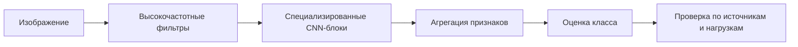

<!-- generated: crypto-stego-course -->
# Нейросетевой стегоанализ

## Кратко

Нейросетевой стегоанализ (Neural Network Steganalysis) использует глубокие модели для поиска слабых следов встраивания непосредственно в изображениях или их остаточных представлениях. В курсе этот подход противопоставляется ручному выделению признаков, а конкретные архитектуры и результаты отражают состояние материала на 2024 год.

## Где применяется

Нейросетевой стегоанализ обучает свёрточную сеть извлекать полезные остаточные признаки вместе с классификатором. Входной сигнал очень слаб по сравнению с содержанием изображения, поэтому архитектуры используют высокочастотную предобработку, ограниченные нелинейности и осторожное уменьшение разрешения. Подтверждающие материалы: [Structural Design of Convolutional Neural Networks for Steganalysis](https://doi.org/10.1109/LSP.2016.2548421), [Yedroudj-Net: An Efficient CNN for Spatial Steganalysis](https://doi.org/10.1109/ICASSP.2018.8461438), [Rich Models for Steganalysis of Digital Images](https://doi.org/10.1109/TIFS.2012.2190402).

## Что нужно знать заранее

- [[Машинное обучение в стегоанализе]]
- [[Статистический стегоанализ]]
- [[Дискретное вейвлет-преобразование]]

## Входные данные и результат

Обычная сеть распознавания объектов учится видеть форму и текстуру, которые здесь являются помехой. Стегосеть должна подавить семантику и усилить едва заметные статистические изменения. Поэтому перенос архитектуры классификации фотографий без изменений часто работает хуже специализированной схемы.

### Основные понятия

| Термин | Простое объяснение |
|---|---|
| Предобработка | фиксированные или обучаемые фильтры подавления содержания |
| TLU | усечённая линейная функция, ограничивающая сильные остатки |
| Batch normalization | нормировка активаций в обучающем пакете |
| Свертка | локальный обучаемый фильтр |
| Ошибка обобщения | качество на независимых источниках и алгоритмах |

## Пошаговый алгоритм

1. Высокочастотная предобработка или первые слои подавляют содержание изображения и усиливают шум встраивания.
2. CNN обучается различать чистые контейнеры и стегоизображения на парных или сбалансированных наборах.
3. Качество оценивается отдельно для конкретного метода встраивания, объёма вложения и источника изображений.

## Формулы и обозначения

$$
\theta^*=\arg\min_\theta\sum_i CE(f_\theta(I_i),y_i),\quad P_e=\tfrac12(P_{FA}+P_{MD})
$$

**Обозначения и смысл.** theta — параметры сети; I_i,y_i — обучающее изображение и метка 0/1; f — прогноз; CE — перекрёстная энтропия. FA/MD — ложные тревоги/пропуски на независимом тесте.

**Условия применения.** Для бинарного прогноза p: CE=−y ln p−(1−y)ln(1−p), 0<p<1. Натуральный логарифм; P_e — равновзвешенная ошибка, а не значение функции потерь.

## Разбор примера

*Происхождение:* Составленный учебный пример; не экспериментальный результат курса.

**Исходные данные.** Проверяем только функцию потерь и оценку готовой сети, не обучение архитектуры. Два примера: метки [1,0], прогнозы вероятности стего [0.8,0.3].

1. Для первого CE=−ln(0.8)≈0.223144; для второго CE=−ln(1−0.3)=−ln(0.7)≈0.356675.
2. Средняя потеря (0.223144+0.356675)/2≈0.289909; при пороге 0.5 оба решения верны.
3. В отдельном тесте из 50 чистых и 50 стего: 5 ложных тревог и 10 пропусков дают P_FA=0.1,P_MD=0.2,P_e=0.15.

**Результат.** Потеря на двух объектах 0.289909, ошибка на другом тесте 15%. Это разные показатели.

**Проверка.** Изменение порога не меняет уже вычисленную CE, но может изменить число ошибок классификации.

**Граница применимости.** Это составленные данные, не воспроизведение GNCNN, TLU-CNN или PNet. Для заявления о качестве сети нужны зафиксированные данные, обучение и независимый тест.

## Иллюстрации из курса

![[90 Attachments/Courses/Основы криптографии и стеганографии/OCS - GNCNN - L14 p26.png]]

*Что смотреть:* архитектуру GNCNN и условия приведённого эксперимента, а не только процент ошибки. *Источник:* [[Source - Основы криптографии и стеганографии - Лекция 14]], стр. 26.

![[90 Attachments/Courses/Основы криптографии и стеганографии/OCS - PNet - L14 p28.png]]

*Что смотреть:* зависимость результата PNet от совпадения метода встраивания при обучении и проверке. *Источник:* [[Source - Основы криптографии и стеганографии - Лекция 14]], стр. 28.

## Схема

## Дополнительное понимание

Числа GNCNN, TLU-CNN и PNet из курса сохраняются только как иллюстрация эволюции. Они не образуют честную таблицу лидеров без одинакового протокола. Современная проверка должна включать минимум три режима: совпадающий алгоритм и источник, новый источник при том же алгоритме и неизвестный алгоритм. Важно также различать полное изображение и патчи: сеть может агрегировать слабый сигнал по большой площади, а оценка патчей меняет задачу. Сильная регуляризация или геометрическая аугментация иногда уничтожает именно тот сигнал, который нужно обнаружить. Поэтому каждое преобразование проверяют симметрично для двух классов и документируют. `status: review` остаётся напоминанием, что практический выбор модели требует отдельного актуального исследования.

## Пояснение и границы применения

Специализированная сеть начинает с подавления содержания, потому что форма объектов и обычная текстура намного сильнее стегосигнала. Первый слой может содержать фиксированные высокочастотные ядра или обучаться из такой инициализации. Усечённые нелинейности ограничивают крупные остатки, а последующие свёртки собирают слабые локальные зависимости. Слишком раннее уменьшение разрешения способно потерять сигнал.

Парность данных помогает обучению, но требует осторожного разбиения. Чистая и стеговерсия одного контейнера принадлежат одной части набора. Патчи одного изображения тоже нельзя распределять между обучением и тестом. Аугментация применяется симметрично и предварительно проверяется: повторное сжатие, интерполяция или шум могут уничтожить след либо создать искусственное различие классов.

Числа для GNCNN, TLU-CNN и PNet из лекции отражают конкретные наборы и протоколы 2024 года. Их нельзя складывать в современный рейтинг без воспроизведения. Сопоставимая оценка фиксирует алгоритм, объём вложения, источник, размер изображения и способ разбиения, а затем сообщает P_FA, P_MD, ROC и несколько запусков с разными начальными состояниями.

Практическая проверка включает три режима: совпадающие обучение и тест, новый источник при том же алгоритме и неизвестный способ встраивания. Карты важности и спектры активаций помогают искать ошибку или побочную подсказку, но сами по себе не объясняют решение. Модель должна сравниваться с Rich Models и простым контролем по метаданным, иначе улучшение нельзя уверенно связать с изучением стегосигнала.

## Датированный материал курса

Перечень адаптивных методов встраивания и результаты трёх CNN сохранены для понимания эволюции подходов. Внешние первичные публикации уточняют общую методику проверки, но не превращают несопоставимые результаты курса в рейтинг современных архитектур.

## Как проверить результат

- Фиксировать начальное случайное значение, версии библиотек, предобработку и точное разбиение.
- Сравнивать с классической базовой моделью и моделью по метаданным.
- Проверять карту значимости или частотную реакцию только как диагностику, а не как доказательство.
- Не сравнивать проценты из разных статей без одинакового набора данных, алгоритма и объёма вложения.

## Ограничения и ошибки

- `status: review`: результаты GNCNN, TLU-CNN, PNet и список HUGO/WOW/S-UNIWARD/J-UNIWARD/UED датированы курсом 2024 года.
- Пример PNet показывает, насколько ошибка зависит от присутствия исследуемого метода встраивания в обучающей выборке.
- Использовать случайное разбиение уже созданных патчей одного изображения.
- Применять аугментацию, которая разрушает стегосигнал или создаёт различие только одного класса.
- Выбирать лучшую эпоху по тестовым результатам.
- Называть старую архитектуру современной без повторной проверки.

## Что запомнить

- Стегосеть подавляет содержание и ищет слабые остаточные следы.
- Данные и разбиение определяют достоверность результата сильнее названия архитектуры.
- Результаты курса 2024 года остаются датированными примерами, а не рейтингом методов.

## Связи

- [[Машинное обучение в стегоанализе]]
- [[Статистический стегоанализ]]
- [[Дискретное вейвлет-преобразование]]
- [[Стеганография в JPEG]]
- [[Стегоанализ]]

## Самопроверка

1. Зачем перед CNN применяют высокочастотную предобработку?
2. Как связаны P_FA, P_MD и средняя вероятность ошибки?
3. Почему результаты GNCNN, TLU-CNN и PNet нельзя сравнивать без условий эксперимента?

> [!answer]- Ответы
> 1. Предобработка подавляет содержание изображения и усиливает слабые высокочастотные следы.
>
> 2. P_FA и P_MD усредняются как P_E=1/2(P_FA+P_MD) при равных весах классов.
>
> 3. Различаются наборы данных, объём вложения, методы встраивания, предобработка и протоколы разбиения.

## Источники

### Материалы курса

- [[Source - Основы криптографии и стеганографии - Лекция 14]], стр. 22–28.

### Дополнительные источники

- [Structural Design of Convolutional Neural Networks for Steganalysis](https://doi.org/10.1109/LSP.2016.2548421) — Guanshuo Xu, Han-Zhou Wu, Yun-Qing Shi, 2016; научная статья.
- [Yedroudj-Net: An Efficient CNN for Spatial Steganalysis](https://doi.org/10.1109/ICASSP.2018.8461438) — Mehdi Yedroudj, Frédéric Comby, Marc Chaumont, 2018; научная статья.
- [Rich Models for Steganalysis of Digital Images](https://doi.org/10.1109/TIFS.2012.2190402) — Jessica Fridrich, Jan Kodovský, 2012; научная статья.
