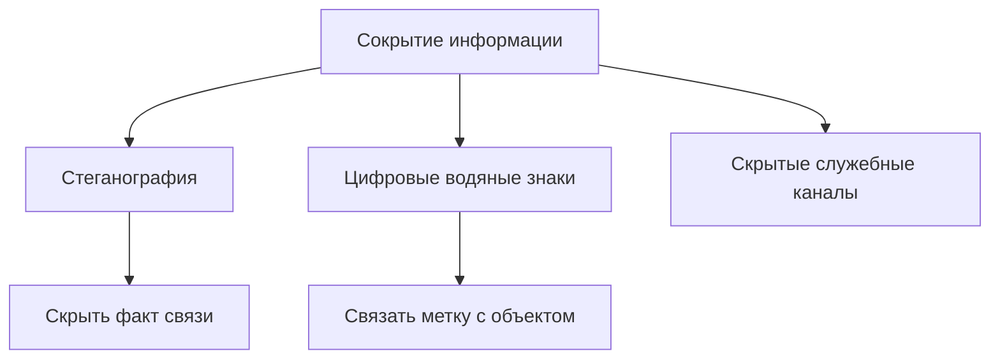

<!-- generated: crypto-stego-course -->
# Сокрытие информации

## Кратко

Сокрытие информации (Information Hiding) — общая область методов, которые помещают дополнительные данные в цифровой объект так, чтобы обеспечить требуемое сочетание незаметности, извлекаемости и устойчивости. Стеганография и цифровые водяные знаки используют общий контейнер, но решают разные задачи.

## Зачем это нужно

Сокрытие информации — общий класс задач, в который входят тайная связь, цифровые водяные знаки и служебные скрытые каналы. Различаются не только алгоритмы, но и цели: в одном случае наблюдатель не должен заметить факт сообщения, в другом метка должна пережить обработку и подтвердить связь с объектом. Подтверждающие материалы: [The Prisoners' Problem and the Subliminal Channel](https://doi.org/10.1007/978-1-4684-4730-9_5), [Information Hiding — A Survey](https://doi.org/10.1109/5.771065).

## Что нужно знать заранее

- [[Cryptosystem and Security Goals]]

## Основные понятия

| Термин | Простое объяснение |
|---|---|
| Контейнер | объект до встраивания |
| Стегообъект | контейнер после встраивания |
| Скрытые данные | сообщение или метка |
| Стегоключ | секретный параметр выбора мест или преобразования |
| Наблюдатель | сторона, пытающаяся обнаружить или разрушить вложение |

## Как это устроено

Обычная криптография похожа на запертый сейф: содержимое не читается, но наличие защищённого объекта очевидно. Стеганография стремится сделать сам сейф незаметным. Водяной знак, напротив, может быть известен, но должен оставаться связанным с произведением после допустимой обработки.

1. Контейнер `C` преобразуется с учётом сообщения `M` и, при необходимости, ключа `K`.
2. Получатель извлекает сообщение или проверяет наличие метки по стегообъекту `S`.
3. Свойства системы оцениваются по ёмкости, визуальному искажению, устойчивости и обнаружимости.

## Формальная модель

$$
S=Embed(C,M,K)
$$

**Обозначения и смысл.** C — исходный контейнер, M — скрытые данные, K — ключ, S — стегообъект. Extract должен вернуть M для предусмотренного класса преобразований.

$$
\hat M=Extract(S,K)
$$

**Обозначения и смысл.** D измеряет искажение между C и S, R — относительную ёмкость, P_D — вероятность обнаружения. Улучшение одного показателя часто ухудшает другие.

## Разобранный пример

Курс рассматривает изображения как основной контейнер и отделяет сокрытие сообщения от встраивания водяного знака для подтверждения происхождения или целостности.

1. Сформулировать цель: скрыть сам факт передачи, отметить владельца или обнаружить изменение.
2. Определить наблюдателя и допустимые операции над объектом.
3. Выбрать контейнер и область встраивания, соответствующие этой модели.
4. Задать метрики качества, ёмкости, извлечения и обнаружимости.
5. Проверить систему на чистых и модифицированных объектах.

## Схема

## Пояснение и границы применения

Систему сокрытия удобно описывать не названием алгоритма, а пятью объектами: контейнером, скрытыми данными, ключом, правилом встраивания и каналом распространения. После этого задаётся наблюдатель. Получатель знает ключ и пытается извлечь сообщение, обычный пользователь оценивает качество, а противник ищет статистические отличия или разрушает вложение. Одна и та же модификация может быть незаметной для человека, но очевидной для классификатора.

Требования конфликтуют. Рост объёма вложения обычно увеличивает искажение и обнаружимость. Усиление устойчивости требует более заметного или избыточного сигнала. Секретность нельзя измерять только PSNR: высокое визуальное качество ничего не говорит о статистическом следе. Поэтому эксперимент заранее фиксирует приоритет и минимально приемлемые значения остальных критериев.

Практическая модель канала особенно важна. Если изображение отправляют через мессенджер, его могут масштабировать и повторно сжать; при архивной передаче байты могут сохраниться точно. Метод, рассчитанный на неизменяемый PNG, не обязан переживать публикацию в социальной сети. Корректный вывод относится только к испытанной цепочке обработки, а не к формату или классу методов вообще.

## Рабочий разбор

Разберите тему как небольшую проверяемую модель. Сначала дайте собственное определение понятия «Контейнер» и отделите его от «Стегообъект». Затем выпишите, какие данные известны до начала работы, что считается результатом и какое условие делает преобразование корректным. Такой конспект помогает заметить скрытые допущения раньше вычислений.

После ручного примера измените ровно один параметр или входное значение. Предскажите результат до пересчёта, повторите процедуру и объясните расхождение, если оно появилось. Контрольный критерий: Успешное извлечение проверять отдельно от незаметности: один результат не доказывает другой. Отдельно проверьте ошибочный вариант «Не определять, какие преобразования считаются допустимыми, а какие — атакой.». В итоге должно быть понятно не только как получить ответ, но и где заканчивается применимость метода.

## Мини-практика

1. Воспроизведите разобранный пример без подсказок и запишите все промежуточные значения.
2. Намеренно смоделируйте типичную ошибку: Считать шифрование и стеганографию взаимозаменяемыми.
3. Проверьте исправленный результат по критерию: Перед сравнением методов фиксировать одинаковые контейнеры, объём данных и модель атакующего.
4. Объясните своими словами главный вывод: Цель определяет требования к вложению.

## Ограничения и типичные ошибки

- Секретность алгоритма не заменяет ключ: анализ предполагает известный метод.
- Оптимизация одного свойства обычно ухудшает другое: большая ёмкость повышает искажение и обнаружимость.
- Считать шифрование и стеганографию взаимозаменяемыми.
- Оценивать систему только визуально.
- Не определять, какие преобразования считаются допустимыми, а какие — атакой.

## Что запомнить

- Цель определяет требования к вложению.
- Незаметность, ёмкость и устойчивость конфликтуют.
- Модель наблюдателя нужна до выбора алгоритма.

## Связи

- [[Цифровая стеганография]]
- [[Цифровые водяные знаки]]
- [[Метрики качества стеганографии]]
- [[Стегоанализ]]

## Самопроверка

1. Чем стеганография отличается от цифровых водяных знаков?
2. Какие роли выполняют контейнер, сообщение и ключ?
3. Какие свойства системы сокрытия информации приходится балансировать?

> [!answer]- Ответы
> 1. Стеганография скрывает факт сообщения, водяной знак связывает метку с объектом и обычно рассчитан на проверку.
>
> 2. Контейнер несёт данные, сообщение является вложением, ключ управляет местами или правилом встраивания.
>
> 3. Основные компромиссы проходят между ёмкостью, искажением, устойчивостью и обнаружимостью.

## Источники

### Материалы курса

- [[Source - Основы криптографии и стеганографии - Лекция 08]], стр. 2–5.

### Дополнительные источники

- [The Prisoners' Problem and the Subliminal Channel](https://doi.org/10.1007/978-1-4684-4730-9_5) — Gustavus J. Simmons, 1984; научная статья.
- [Information Hiding — A Survey](https://doi.org/10.1109/5.771065) — Fabien A. P. Petitcolas, Ross J. Anderson, Markus G. Kuhn, 1999; научная статья.
