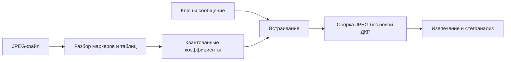

<!-- generated: crypto-stego-course -->
# Стеганография в JPEG

## Кратко

Стеганография в JPEG изменяет квантованные коэффициенты ДКП внутри процесса JPEG-кодирования. Методы должны сохранять корректную структуру файла и учитывать особую роль нулей, значений ±1, а также DC- и AC-коэффициентов.

## Зачем это нужно

Стеганография в JPEG работает с квантованными коэффициентами ДКП или с решениями, которые будут устойчиво отражены в JPEG-потоке. Она должна учитывать нули, значения ±1, порядок обхода, таблицы квантования и повторное кодирование. Непосредственная правка байтов сжатого файла без понимания синтаксиса обычно разрушает данные. Подтверждающие материалы: [ITU-T Recommendation T.81 — JPEG-1](https://www.itu.int/ITU-T/recommendations/rec.aspx?lang=en&rec=2633), [Attacks on Steganographic Systems](https://doi.org/10.1007/3-540-46506-5_5), [F5 — A Steganographic Algorithm](https://www2.htw-dresden.de/~westfeld/publikationen/f5.pdf).

## Что нужно знать заранее

- [[Сжатие изображений в JPEG]]
- [[Стеганография в частотной области]]
- [[Цифровая стеганография]]

## Основные понятия

| Термин | Простое объяснение |
|---|---|
| Квантованный коэффициент | целое значение после деления на таблицу Q |
| Ненулевой AC | частотный коэффициент, доступный для многих схем |
| Обнуление | переход ±1 в 0 после изменения |
| Матричное кодирование | передача нескольких битов малым числом изменений |
| Перестановочное распределение | ключевой псевдослучайный обход коэффициентов |

## Как это устроено

JPEG уже удалил многие мелкие детали и оставил разреженный набор целых коэффициентов. Изменение младшего бита такого числа может пережить простое копирование потока, но повторное кодирование из пикселей создаёт новые коэффициенты. Кроме того, систематические изменения деформируют их гистограмму.

1. JPEG декодируется до квантованных коэффициентов, не обязательно до пикселей.
2. Пригодные AC-коэффициенты выбираются по правилам метода и порядку ключа.
3. После модификации коэффициенты снова энтропийно кодируются.

## Формальная модель

$$
\hat G_{uv}=round(G_{uv}/Q_{uv})
$$

**Обозначения и смысл.** q_{u,v} — квантованный коэффициент, b — бит сообщения. Функция phi зависит от алгоритма: JSteg, F3, F4 и F5 по-разному трактуют знак и значения ±1.

$$
\hat G_{uv}'=Embed(\hat G_{uv},m_i)
$$

**Обозначения и смысл.** eta выражает число переданных битов на одно фактическое изменение. Матричное кодирование повышает эту эффективность, уменьшая статистический след при малом объёме сообщения.

## Разобранный пример

Курс последовательно рассматривает JSteg, PM1, F3, F4 и F5 как способы уменьшить статистические следы и корректно обработать обнуление квантованных коэффициентов.

1. Разобрать JPEG и получить квантованные коэффициенты без обратного перехода к пикселям.
2. Исключить DC, нули и другие запрещённые значения согласно конкретному алгоритму.
3. Переставить кандидаты по ключу и последовательно встроить длину, данные и контроль целостности.
4. Пересобрать JPEG с исходными таблицами и параметрами без повторной ДКП.
5. Снова разобрать поток, извлечь биты и отдельно проверить поведение после полного повторного кодирования.

## Схема

## Дополнительное понимание

Стегоалгоритм должен различать изменение коэффициентов и повторное сжатие пикселей. В первом случае можно сохранить исходные таблицы и большинство коэффициентов буквально, во втором округление вычисляет новый набор значений. Даже при одинаковом визуальном качестве второй путь способен уничтожить вложение. Синхронизация сообщения зависит от правил пропуска: если встраиватель после обнуления повторяет тот же бит в следующем коэффициенте, извлекатель должен воспроизводить соответствующую логику. Длина сообщения и завершение потока также кодируются так, чтобы случайный шум не заставлял читать лишние коэффициенты. Безопасность не равна отсутствию явного заголовка: гистограммы, межблочные зависимости и распределение позиций могут выдавать алгоритм. Поэтому практический отчёт включает объём вложения на ненулевой AC, эффективность изменений и ошибку детектора.

## Пояснение и границы применения

JPEG-стеганография должна указывать уровень работы. Один вариант декодирует изображение в пиксели, меняет их и снова сжимает; другой разбирает поток до квантованных коэффициентов, меняет целые значения и повторно кодирует энтропийную часть. Второй путь лучше контролирует канал, но требует корректно сохранить таблицы, порядок блоков, компоненты, рестарт-маркеры и служебные сегменты.

Нулевые и единичные AC-коэффициенты требуют особого внимания. Изменение нуля увеличивает число ненулевых коэффициентов и длину потока, а уменьшение ±1 до нуля создаёт усадку: выбранная позиция исчезает из последовательности пригодных значений. JSteg, F3/F4 и F5 по-разному решают эти проблемы, поэтому их нельзя описывать общей фразой «меняют младший бит».

Повторное сжатие не просто добавляет случайный шум. Оно пересчитывает блоки после цветового преобразования и округления, а новая таблица квантования систематически меняет коэффициенты. Устойчивость зависит от согласования таблиц и качества, компоненты и частотной позиции. Если задача — скрытая передача без преобразований, допустима точная транспортировка JPEG; если ожидается публикация платформой, канал моделируют отдельно.

Оценка включает битовую ошибку, усадку, фактический объём, изменение размера файла и статистику коэффициентов. Чистые контрольные JPEG должны происходить из того же процесса кодирования. Иначе классификатор может различать кодировщики или таблицы, а не вложение.

## Рабочий разбор

Для практической проверки разделите систему на источник данных, преобразование, канал и решающее правило. Зафиксируйте единицы измерения, диапазоны и точность промежуточных величин. Термин «Квантованный коэффициент» должен иметь одно операционное определение, а «Перестановочное распределение» — измеримый критерий. Это не формальность: изменение округления, порядка обхода или представления данных способно дать другой результат при той же формуле.

Проведите три опыта. Первый подтверждает разобранный пример на малых данных, где все шаги можно проверить вручную. Второй меняет один параметр и показывает ожидаемый компромисс качества, устойчивости или сложности. Третий имитирует ошибку «Сравнивать ёмкость методов без учёта числа реально изменённых коэффициентов.» и должен завершиться контролируемым отказом либо заметным ухудшением метрики. Для каждого опыта сохраните вход, параметры, промежуточные значения и итог.

Вывод формулируйте только в границах испытания. Проверка «Оценить гистограммы, специализированные детекторы и общий стегоанализ на независимых файлах.» показывает, переносится ли наблюдение за пределы одного примера. Если результат меняется при новом источнике данных или другой цепочке обработки, это ограничение метода нужно записать явно, а не скрывать усреднённой оценкой.

## Мини-практика

1. Воспроизведите разобранный пример без подсказок и запишите все промежуточные значения.
2. Намеренно смоделируйте типичную ошибку: Изменять байты энтропийно закодированного сегмента как обычный массив.
3. Проверьте исправленный результат по критерию: Сравнить таблицы квантования, порядок компонентов и коэффициенты до и после.
4. Объясните своими словами главный вывод: JPEG-стеганография опирается на квантованные коэффициенты и структуру кодека.

## Ограничения и типичные ошибки

- Повторное полное JPEG-кодирование меняет коэффициенты и может уничтожить скрытые данные.
- Изменение нулей и малых коэффициентов сильно влияет на длины серий, размер файла и статистическую обнаружимость.
- Изменять байты энтропийно закодированного сегмента как обычный массив.
- Встраивать в нули или DC, когда алгоритм этого не допускает.
- Сохранять результат через обычный графический редактор и считать коэффициенты неизменными.
- Сравнивать ёмкость методов без учёта числа реально изменённых коэффициентов.

## Что запомнить

- JPEG-стеганография опирается на квантованные коэффициенты и структуру кодека.
- Обнуление и знак коэффициента определяют корректность извлечения.
- Повторное JPEG-кодирование — отдельный канал, который нужно тестировать.

## Связи

- [[Сжатие изображений в JPEG]]
- [[JSteg]]
- [[Методы F3 и F4 в JPEG]]
- [[Метод F5 в JPEG]]
- [[Статистический стегоанализ]]

## Самопроверка

1. На каком представлении JPEG выполняется встраивание?
2. Почему нулевые и малые коэффициенты требуют особой обработки?
3. Как повторное JPEG-кодирование влияет на сообщение и статистику коэффициентов?

> [!answer]- Ответы
> 1. Подходящими носителями служат выбранные ненулевые AC-коэффициенты после квантования.
>
> 2. Нули не несут устойчивого бита, а ±1 при изменении могут стать нулём и нарушить синхронизацию.
>
> 3. Нужно повторно разобрать JPEG, извлечь сообщение, посчитать изменения и проверить статистические следы.

## Источники

### Материалы курса

- [[Source - Основы криптографии и стеганографии - Лекция 13]], стр. 10–15.
- [[Source - Основы криптографии и стеганографии - Лекция 14]], стр. 7–8, 14–16.

### Дополнительные источники

- [ITU-T Recommendation T.81 — JPEG-1](https://www.itu.int/ITU-T/recommendations/rec.aspx?lang=en&rec=2633) — ITU-T and ISO/IEC, 1992; официальный стандарт.
- [Attacks on Steganographic Systems](https://doi.org/10.1007/3-540-46506-5_5) — Andreas Westfeld, Andreas Pfitzmann, 2000; научная статья.
- [F5 — A Steganographic Algorithm](https://www2.htw-dresden.de/~westfeld/publikationen/f5.pdf) — Andreas Westfeld, 2001; авторская публикация.
