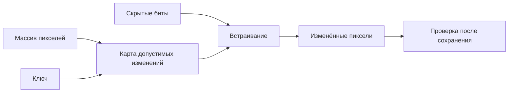

<!-- generated: crypto-stego-course -->
# Стеганография в пространственной области

## Кратко

Стеганография в пространственной области (Spatial-Domain Image Steganography) изменяет значения пикселей непосредственно. Методы просты и ёмки, но изменения могут быть уничтожены обработкой изображения или выявлены статистикой соседних значений.

## Зачем это нужно

Пространственные методы изменяют значения пикселей напрямую. Их легче понять и реализовать, но изменения проходят через цветовые преобразования, фильтры, масштабирование и сжатие. Поэтому простота записи должна сопровождаться проверкой полного канала и статистики соседних пикселей. Подтверждающие материалы: [Techniques for Data Hiding](https://doi.org/10.1147/sj.353.0313), [LSB Matching Revisited](https://doi.org/10.1109/LSP.2006.870357).

## Что нужно знать заранее

- [[Основы цифровых изображений]]
- [[Цифровая стеганография]]

## Основные понятия

| Термин | Простое объяснение |
|---|---|
| Пространственная область | непосредственный массив пикселей |
| Младший бит | бит с минимальным вкладом в значение |
| Адаптивность | изменение плотности встраивания по свойствам области |
| Карта стоимости | оценка заметности изменения каждого элемента |

## Как это устроено

Изменение одного младшего бита обычно почти незаметно глазу, но миллионы одинаково организованных изменений перестраивают статистику изображения. Текстурированные области допускают больше изменений, чем гладкие, потому что естественная вариативность лучше маскирует след.

1. Изображение обходится по выбранному ключом порядку.
2. Для каждого элемента кодируется один или несколько битов через замену, изменение чётности или адаптивную разность.
3. Получатель повторяет порядок и восстанавливает биты из значений пикселей.

## Формальная модель

$$
P_i^\prime=P_i+\Delta(P_i,m_i,K),\quad\hat m_i=Decode(P_i^\prime,K)
$$

**Обозначения и смысл.** P_i — исходный пиксель, m_i — бит, K — параметры выбора позиций; Delta — целочисленное изменение, P-prime — итог; Decode — согласованное правило извлечения.

**Условия применения.** Для 8-битного канала 0≤P-prime≤255. Конкретную Delta задаёт метод, а не общая формула; в примере используется LSB.

## Разобранный пример

*Происхождение:* Составленный учебный пример; не экспериментальный результат курса.

**Исходные данные.** Четыре отсчёта [20,21,254,255], сообщение 1100; меняется младший бит каждого отсчёта.

1. Delta по позициям: +1,0,0,−1; итог [21,21,254,254].
2. Извлечение чётности даёт [1,1,0,0].

**Результат.** Два изменения передали четыре бита.

**Проверка.** MSE=(1+0+0+1)/4=0.5; ни один отсчёт не вышел за 0…255.

**Граница применимости.** При сохранении через преобразование с потерями чётность может измениться. Для этого примера требуется канал, сохраняющий отсчёты.

## Схема

## Пояснение и границы применения

Пространственный метод работает с отсчётами, которые возвращает декодер: пикселями или компонентами цвета. Это упрощает реализацию, но не гарантирует сохранение после записи файла. Повторное кодирование JPEG, перевод цвета или изменение разрядности может изменить младшие биты даже визуально того же изображения.

Карта сложности должна вычисляться одинаково у обеих сторон или задаваться ключом. На гладком фоне изменение заметнее, на текстуре выбор позиций шире, но сама адаптация тоже меняет распределение. Случайный выбор не равен безопасному: генератор должен быть криптографическим.

Полезный тест включает однотонную область, текстуру, границы и значения 0 и 255. После сохранения файл декодируют заново и извлекают сообщение именно из полученного массива.

## Ограничения и типичные ошибки

- Сжатие с потерями, изменение размера и цветовая коррекция меняют пиксели и разрушают вложение.
- Последовательное заполнение и большой объём вложения создают выраженные статистические следы.
- Последовательно заполнять пиксели от начала файла.
- Не учитывать палитровый или индексированный формат.
- Считать малую амплитуду каждого изменения гарантией скрытности.

## Что запомнить

- Пространственные методы работают с пикселями напрямую.
- Малая визуальная ошибка может оставлять сильный статистический след.
- Адаптивный выбор мест обычно важнее самой амплитуды изменения.

## Связи

- [[LSB-стеганография]]
- [[Метод ±1 в стеганографии]]
- [[Метод разности значений пикселей (PVD)]]
- [[Интерполяция по среднему значению соседних пикселей (NMI)]]
- [[Статистический стегоанализ]]

## Самопроверка

1. Какие элементы изображения изменяются при встраивании в пространственной области?
2. Почему сжатие с потерями и изменение размера разрушают такое вложение?
3. Чем последовательный обход отличается от ключевого или адаптивного выбора пикселей?

> [!answer]- Ответы
> 1. Изменяются отсчёты пикселей выбранных каналов, например их младшие биты, разности или значения относительно прогноза.
>
> 2. Пересчёт пикселей меняет чётность, значения и позиции, на которые рассчитывает извлекатель.
>
> 3. Последовательный обход берёт позиции по порядку, ключевой — по воспроизводимой перестановке, адаптивный учитывает свойства области и цену изменения.

## Источники

### Материалы курса

- [[Source - Основы криптографии и стеганографии - Лекция 08]], стр. 6–9.
- [[Source - Основы криптографии и стеганографии - Лекция 10]], стр. 2–13.

### Дополнительные источники

- [Techniques for Data Hiding](https://doi.org/10.1147/sj.353.0313) — Walter Bender, Daniel Gruhl, Norishige Morimoto, Anthony Lu, 1996; научная статья.
- [LSB Matching Revisited](https://doi.org/10.1109/LSP.2006.870357) — Jarno Mielikäinen, 2006; научная статья.
