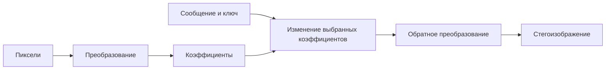

<!-- generated: crypto-stego-course -->
# Стеганография в частотной области

## Кратко

Стеганография в частотной области (Frequency-Domain Image Steganography) встраивает данные в коэффициенты преобразования, после чего выполняется обратное преобразование. Такие методы обычно устойчивее к части последующей обработки, но сложнее и чувствительны к ошибкам округления.

## Зачем это нужно

Частотное встраивание изменяет коэффициенты преобразования вместо отдельных пикселей. Это позволяет распределить влияние по области изображения и выбирать компоненты, которые переживают заданную обработку. Но результат зависит от базиса, масштаба, квантования и статистики выбранных коэффициентов. Подтверждающие материалы: [Secure Spread Spectrum Watermarking for Multimedia](https://doi.org/10.1109/83.650120), [Quantization Index Modulation: A Class of Provably Good Methods for Digital Watermarking and Information Embedding](https://doi.org/10.1109/18.923725).

## Что нужно знать заранее

- [[Частотные преобразования изображений]]
- [[Цифровая стеганография]]

## Основные понятия

| Термин | Простое объяснение |
|---|---|
| Коэффициент преобразования | вес базисной функции |
| Полоса | группа низких, средних или высоких частот |
| Маска встраивания | правило выбора коэффициентов |
| Обратное преобразование | возврат изменённых коэффициентов к пикселям |

## Как это устроено

Изменение одного коэффициента похоже не на исправление одного пикселя, а на добавление слабого узора ко всему блоку или области. Низкие частоты устойчивее, но сильнее влияют на вид; высокие легче спрятать, но кодек или фильтр может их удалить.

1. Контейнер преобразуется с помощью ДКП, ДПФ, преобразования Уолша—Адамара или вейвлет-преобразования.
2. При встраивании выбранные коэффициенты изменяются с учётом частотной области и заданной силы.
3. После обратного преобразования пиксели округляются; получатель снова вычисляет спектр и извлекает биты.

## Формальная модель

$$
F=T(C),\quad F'=Embed(F,M,K),\quad S=T^{-1}(F')
$$

**Обозначения и смысл.** T — прямое преобразование, Y — коэффициенты, Delta(M,K) — управляемая сообщением и ключом модификация. Обратное T^{-1} распределяет её по пикселям.

$$
\hat M=Extract(T(S),K)
$$

**Обозначения и смысл.** Выражение со стоимостью rho_i формализует выбор: изменения должны передать сообщение при минимальном суммарном искажении в выбранной модели.

## Разобранный пример

Схема курса показывает, что даже без внешнего воздействия округление вещественных пикселей может дать `BER>0`; предлагается итеративно проверять и повторять встраивание.

1. Разделить изображение на блоки или выполнить глобальное преобразование.
2. По ключу выбрать коэффициенты средней полосы, исключив нулевые и нестабильные позиции.
3. Изменить их знаком, отношением пары или QIM-решёткой.
4. Выполнить обратное преобразование и сохранить объект.
5. После ожидаемой обработки снова вычислить коэффициенты и извлечь решение.

## Схема

## Пояснение и границы применения

Частотный метод состоит из двух разных частей: преобразования изображения и правила изменения коэффициентов. Само упоминание ДКП или вейвлетов не определяет безопасность. Нужно указать размер блока, канал цвета, нормировку, выбранные поддиапазоны, порядок коэффициентов, величину изменения и способ обратного округления.

Низкие частоты несут заметную структуру, высокие чаще удаляются обработкой, поэтому средняя область служит отправной точкой, а не законом. Для JPEG удобнее менять уже квантованные целые коэффициенты: тогда понятнее, какие числа попадут в поток. Изменение вещественных ДКП-коэффициентов пиксельного изображения с последующим обычным сохранением может пройти через второе независимое квантование.

Устойчивость проверяют после каждого звена канала отдельно и в комбинации. Если метод переживает шум, но не повторное JPEG-сжатие, это должно быть видно из отчёта. Обнаружимость исследуют по распределениям и соседним зависимостям коэффициентов; выбор только ненулевых значений или определённых позиций тоже создаёт след. Наконец, обратное преобразование проверяют на переполнение и округление пикселей.

## Рабочий разбор

Разберите тему как небольшую проверяемую модель. Сначала дайте собственное определение понятия «Коэффициент преобразования» и отделите его от «Полоса». Затем выпишите, какие данные известны до начала работы, что считается результатом и какое условие делает преобразование корректным. Такой конспект помогает заметить скрытые допущения раньше вычислений.

После ручного примера измените ровно один параметр или входное значение. Предскажите результат до пересчёта, повторите процедуру и объясните расхождение, если оно появилось. Контрольный критерий: Проверять устойчивость после реального кодека или фильтра. Отдельно проверьте ошибочный вариант «Считать изменение коэффициента локальным одному пикселю.». В итоге должно быть понятно не только как получить ответ, но и где заканчивается применимость метода.

## Мини-практика

1. Воспроизведите разобранный пример без подсказок и запишите все промежуточные значения.
2. Намеренно смоделируйте типичную ошибку: Всегда выбирать самые высокие частоты.
3. Проверьте исправленный результат по критерию: Сверять нормировку и порядок коэффициентов между встраивателем и извлекателем.
4. Объясните своими словами главный вывод: Влияние коэффициента распределяется по области базисной функции.

## Ограничения и типичные ошибки

- Выбор слишком низких частот заметен, слишком высоких — хрупок.
- Реализация должна учитывать нормировку преобразования и повторное целочисленное округление.
- Всегда выбирать самые высокие частоты.
- Игнорировать квантование после встраивания.
- Считать изменение коэффициента локальным одному пикселю.

## Что запомнить

- Влияние коэффициента распределяется по области базисной функции.
- Выбор полосы задаёт компромисс заметности и устойчивости.
- Канал обработки должен входить в эксперимент.

## Связи

- [[Частотные преобразования изображений]]
- [[Метод Коха—Жао]]
- [[Модуляция индекса квантования (QIM)]]
- [[Стеганография в JPEG]]
- [[Стегоанализ]]

## Самопроверка

1. Какие коэффициенты преобразования выбираются для встраивания?
2. Почему частотное встраивание может пережить часть последующей обработки?
3. Как ошибки округления влияют на извлечение сообщения?

> [!answer]- Ответы
> 1. Модифицируются коэффициенты преобразования, а не непосредственные значения пикселей.
>
> 2. Средние частоты часто дают компромисс между заметностью и сохранностью.
>
> 3. Нужно выполнить обратное преобразование, обработку и повторный анализ коэффициентов.

## Источники

### Материалы курса

- [[Source - Основы криптографии и стеганографии - Лекция 08]], стр. 6–8.
- [[Source - Основы криптографии и стеганографии - Лекция 13]], стр. 2–9.

### Дополнительные источники

- [Secure Spread Spectrum Watermarking for Multimedia](https://doi.org/10.1109/83.650120) — Ingemar J. Cox, Joe Kilian, F. Thomson Leighton, Talal Shamoon, 1997; научная статья.
- [Quantization Index Modulation: A Class of Provably Good Methods for Digital Watermarking and Information Embedding](https://doi.org/10.1109/18.923725) — Brian Chen, Gregory W. Wornell, 2001; научная статья.
