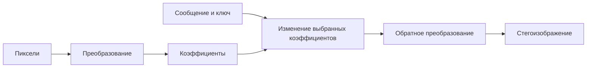

<!-- generated: crypto-stego-course -->
# Стеганография в частотной области

## Кратко

Стеганография в частотной области (Frequency-Domain Image Steganography) встраивает данные в коэффициенты преобразования, после чего выполняется обратное преобразование. Такие методы обычно устойчивее к части последующей обработки, но сложнее и чувствительны к ошибкам округления.

## Зачем это нужно

Частотное встраивание изменяет коэффициенты преобразования вместо отдельных пикселей. Это позволяет распределить влияние по области изображения и выбирать компоненты, которые переживают заданную обработку. Но результат зависит от базиса, масштаба, квантования и статистики выбранных коэффициентов. Подтверждающие материалы: [Secure Spread Spectrum Watermarking for Multimedia](https://doi.org/10.1109/83.650120), [Quantization Index Modulation: A Class of Provably Good Methods for Digital Watermarking and Information Embedding](https://doi.org/10.1109/18.923725).

## Что нужно знать заранее

- [[Частотные преобразования изображений]]
- [[Цифровая стеганография]]

## Основные понятия

| Термин | Простое объяснение |
|---|---|
| Коэффициент преобразования | вес базисной функции |
| Полоса | группа низких, средних или высоких частот |
| Маска встраивания | правило выбора коэффициентов |
| Обратное преобразование | возврат изменённых коэффициентов к пикселям |

## Как это устроено

Изменение одного коэффициента похоже не на исправление одного пикселя, а на добавление слабого узора ко всему блоку или области. Низкие частоты устойчивее, но сильнее влияют на вид; высокие легче спрятать, но кодек или фильтр может их удалить.

1. Контейнер преобразуется с помощью ДКП, ДПФ, преобразования Уолша—Адамара или вейвлет-преобразования.
2. При встраивании выбранные коэффициенты изменяются с учётом частотной области и заданной силы.
3. После обратного преобразования пиксели округляются; получатель снова вычисляет спектр и извлекает биты.

## Формальная модель

$$
F=T(C),\quad F^\prime=Embed(F,M,K),\quad S=T^{-1}(F^\prime),\quad\hat M=Extract(T(S),K)
$$

**Обозначения и смысл.** C — растр, T — обратимое преобразование, F — коэффициенты; M — сообщение, K — параметры; S — восстановленный стегорастр.

**Условия применения.** При идеальной арифметике T(T^{-1}(F-prime))=F-prime. Округление пикселей, обрезка диапазона и повторное сжатие нарушают это равенство.

## Разобранный пример

*Происхождение:* Составленный учебный пример; не экспериментальный результат курса.

**Исходные данные.** Два отсчёта C=[10,14]; учебное ненормированное преобразование T(C)=(c1+c2,c1−c2)=(24,−4). Кодируем бит 1 нечётностью второго целого коэффициента.

1. Изменить −4→−3, получить F-prime=(24,−3).
2. Обратно S=((24−3)/2,(24+3)/2)=(10.5,13.5). В точной арифметике повторное T возвращает (24,−3), извлекается 1.
3. Если округлить пиксели до целых с половинами вверх, S=(11,14), повторная разность −3 сохраняет бит.

**Результат.** На выбранных числах извлечение работает и после указанного округления.

**Проверка.** Если вместо этого округлять половины к чётному, S=(10,14), разность −4 и извлекается 0.

**Граница применимости.** Это двухотсчётная модель, не JPEG. Она показывает, почему реализация должна задавать округление, а обратимость вещественного T недостаточна.

## Схема

## Пояснение и границы применения

Частотный метод состоит из двух разных частей: преобразования изображения и правила изменения коэффициентов. Само упоминание ДКП или вейвлетов не определяет безопасность. Нужно указать размер блока, канал цвета, нормировку, выбранные поддиапазоны, порядок коэффициентов, величину изменения и способ обратного округления.

Низкие частоты несут заметную структуру, высокие чаще удаляются обработкой, поэтому средняя область служит отправной точкой, а не законом. Для JPEG удобнее менять уже квантованные целые коэффициенты: тогда понятнее, какие числа попадут в поток. Изменение вещественных ДКП-коэффициентов пиксельного изображения с последующим обычным сохранением может пройти через второе независимое квантование.

Устойчивость проверяют после каждого звена канала отдельно и в комбинации. Если метод переживает шум, но не повторное JPEG-сжатие, это должно быть видно из отчёта. Обнаружимость исследуют по распределениям и соседним зависимостям коэффициентов; выбор только ненулевых значений или определённых позиций тоже создаёт след. Наконец, обратное преобразование проверяют на переполнение и округление пикселей.

## Ограничения и типичные ошибки

- Выбор слишком низких частот заметен, слишком высоких — хрупок.
- Реализация должна учитывать нормировку преобразования и повторное целочисленное округление.
- Всегда выбирать самые высокие частоты.
- Игнорировать квантование после встраивания.
- Считать изменение коэффициента локальным одному пикселю.

## Что запомнить

- Влияние коэффициента распределяется по области базисной функции.
- Выбор полосы задаёт компромисс заметности и устойчивости.
- Канал обработки должен входить в эксперимент.

## Связи

- [[Частотные преобразования изображений]]
- [[Метод Коха—Жао]]
- [[Модуляция индекса квантования (QIM)]]
- [[Стеганография в JPEG]]
- [[Стегоанализ]]

## Самопроверка

1. Какие коэффициенты преобразования выбираются для встраивания?
2. Почему частотное встраивание может пережить часть последующей обработки?
3. Как ошибки округления влияют на извлечение сообщения?

> [!answer]- Ответы
> 1. Выбор зависит от метода: например, заданные среднечастотные коэффициенты блока; их индексы, нормировка и порядок должны совпадать у обеих сторон.
>
> 2. Можно выбрать компоненты и запас решения, сохраняющиеся после конкретной обработки, но само частотное представление устойчивости не гарантирует.
>
> 3. Округление пикселей после обратного преобразования меняет повторно вычисленные коэффициенты; они могут пересечь порог или сменить чётность и дать неверный бит.

## Источники

### Материалы курса

- [[Source - Основы криптографии и стеганографии - Лекция 08]], стр. 6–8.
- [[Source - Основы криптографии и стеганографии - Лекция 13]], стр. 2–9.

### Дополнительные источники

- [Secure Spread Spectrum Watermarking for Multimedia](https://doi.org/10.1109/83.650120) — Ingemar J. Cox, Joe Kilian, F. Thomson Leighton, Talal Shamoon, 1997; научная статья.
- [Quantization Index Modulation: A Class of Provably Good Methods for Digital Watermarking and Information Embedding](https://doi.org/10.1109/18.923725) — Brian Chen, Gregory W. Wornell, 2001; научная статья.
