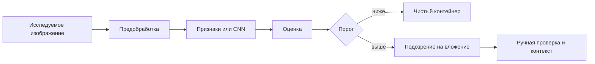

<!-- generated: crypto-stego-course -->
# Стегоанализ

## Кратко

Стегоанализ (Steganalysis) исследует наличие, тип или параметры скрытого вложения в цифровом объекте. Базовая задача курса — бинарная классификация: определить, является изображение чистым контейнером или стегообъектом.

## Зачем это нужно

Стегоанализ проверяет гипотезу о наличии скрытых данных и, в более узких задачах, оценивает алгоритм или объём вложения. Он работает не с красотой изображения, а с отклонениями от модели естественного источника. Чем лучше модель контейнера, тем слабее след можно обнаружить. Подтверждающие материалы: [Attacks on Steganographic Systems](https://doi.org/10.1007/3-540-46506-5_5), [Detecting LSB Steganography in Color and Gray-Scale Images](https://doi.org/10.1109/93.959097), [Rich Models for Steganalysis of Digital Images](https://doi.org/10.1109/TIFS.2012.2190402).

## Что нужно знать заранее

- [[Цифровая стеганография]]
- [[Метрики качества стеганографии]]
- [[Cryptanalysis]]

## Основные понятия

| Термин | Простое объяснение |
|---|---|
| Нулевая гипотеза H0 | объект не содержит вложения |
| Альтернатива H1 | объект содержит вложение |
| Целевой детектор | поиск следа конкретного алгоритма |
| Универсальный детектор | классификатор широкого семейства изменений |
| Несовпадение источников | различие распределений обучения и эксплуатации |

## Как это устроено

Детектор похож на эксперта по почерку: он не обязан извлекать сообщение, достаточно заметить неестественные закономерности. Но если обучающие чистые изображения сделаны другой камерой, эксперт может распознавать камеры вместо встраивания и показывать ложное высокое качество.

1. Визуальные методы исследуют битовые плоскости, спектры и гистограммы.
2. Статистические методы проверяют ожидаемые распределения и зависимости.
3. Машинное обучение строит признаки или извлекает их автоматически и обучает классификатор на чистых и модифицированных примерах.

## Формальная модель

$$
\delta(I)\in\{cover,stego\}
$$

**Обозначения и смысл.** Логарифм отношения правдоподобий сравнивает, насколько наблюдение вероятно при H1 и H0. Порог tau управляет компромиссом ошибок.

$$
P_e=P(\delta(C)=stego)+P(\delta(S)=cover)
$$

**Обозначения и смысл.** P_FA — доля чистых объектов, ошибочно признанных стего, P_MD — доля пропущенных стегообъектов. Средняя ошибка 1/2 соответствует случайному решению при равных классах.

## Разобранный пример

Лекция проходит путь от просмотра LSB-плоскостей до CNN и подчёркивает необходимость выборки, соответствующей конкретным контейнерам и методам встраивания.

1. Определить H0, H1, источник изображений, алгоритм и диапазон объёма вложения.
2. Разделить данные по исходным изображениям до создания стеговерсий, исключив утечку пар между выборками.
3. Построить простой целевой признак или обучить модель только на тренировочной части.
4. Зафиксировать порог без просмотра тестовых меток.
5. Посчитать матрицу ошибок, ROC и ошибку по источникам и уровням вложения.

## Схема

## Дополнительное понимание

Целевой детектор использует известное изменение: например, выравнивание пар гистограммы при LSB-замене. Он хорошо интерпретируется, но легко теряет чувствительность к другому алгоритму. Универсальный подход строит множество остаточных признаков или обучает нейронную сеть, чтобы находить более широкий класс следов. Цена универсальности — зависимость от данных и трудность объяснения решения. В обоих случаях операционная вероятность скрытого сообщения обычно намного ниже 1/2, поэтому лабораторная сбалансированная доля правильных ответов не отражает число ложных тревог в реальном потоке. Для практики важны калибровка вероятностей, базовая частота события и ручная проверка результата. Стегоанализ не доказывает содержание или намерение: он формирует технический сигнал для дальнейшего исследования.

## Пояснение и границы применения

Стегоанализ формулирует гипотезы: H0 означает чистый контейнер, H1 — наличие вложения определённого или неизвестного типа. Детектор выдаёт оценку или класс, а порог превращает её в решение. Понижение порога обычно уменьшает пропуски, но увеличивает ложные тревоги. Поэтому одна доля правильных ответов скрывает важный компромисс.

Целевой анализ использует конкретный след, например парное выравнивание JSteg или LSB-замены. Универсальный собирает широкий набор остаточных признаков и обучается на примерах. Первый может быть мощнее при совпадении алгоритма, второй — переносимее, но ни один не гарантирует работу при другом источнике изображений.

Корректный набор разделяют по исходным контейнерам до создания стеговариантов. Иначе почти одинаковые пары попадают в обучение и тест. Баланс классов удобен для исследования, но в реальной проверке стегообъекты могут быть редки; тогда даже малая частота ложных тревог создаёт много ручной работы. Отчёт включает ROC или несколько порогов, P_FA, P_MD и условия источника.

Решение детектора является основанием для дальнейшей проверки, а не автоматическим доказательством сообщения. Подтверждение может включать извлечение с известным ключом, повторяемость на связанных объектах и исключение обычной обработки, создающей похожий след.

## Рабочий разбор

Для практической проверки разделите систему на источник данных, преобразование, канал и решающее правило. Зафиксируйте единицы измерения, диапазоны и точность промежуточных величин. Термин «Нулевая гипотеза H0» должен иметь одно операционное определение, а «Несовпадение источников» — измеримый критерий. Это не формальность: изменение округления, порядка обхода или представления данных способно дать другой результат при той же формуле.

Проведите три опыта. Первый подтверждает разобранный пример на малых данных, где все шаги можно проверить вручную. Второй меняет один параметр и показывает ожидаемый компромисс качества, устойчивости или сложности. Третий имитирует ошибку «Считать отрицательное решение доказательством отсутствия скрытых данных.» и должен завершиться контролируемым отказом либо заметным ухудшением метрики. Для каждого опыта сохраните вход, параметры, промежуточные значения и итог.

Вывод формулируйте только в границах испытания. Проверка «Проводить тест на чистом внешнем наборе для оценки ложных тревог.» показывает, переносится ли наблюдение за пределы одного примера. Если результат меняется при новом источнике данных или другой цепочке обработки, это ограничение метода нужно записать явно, а не скрывать усреднённой оценкой.

## Мини-практика

1. Воспроизведите разобранный пример без подсказок и запишите все промежуточные значения.
2. Намеренно смоделируйте типичную ошибку: Смешивать производные одного изображения между обучающей и тестовой выборками после аугментаций.
3. Проверьте исправленный результат по критерию: Использовать парное разбиение: варианты одного исходного контейнера не должны попадать в разные части.
4. Объясните своими словами главный вывод: Стегоанализ — статистическая проверка гипотез, а не обязательное извлечение сообщения.

## Ограничения и типичные ошибки

- Детектор может запомнить особенности камеры, цепочки обработки или источника данных вместо следа встраивания.
- Результаты нельзя переносить на другой объём вложения, формат или распределение изображений без новой проверки.
- Смешивать производные одного изображения между обучающей и тестовой выборками после аугментаций.
- Выбирать порог по тестовой выборке.
- Сообщать только долю правильных ответов на несбалансированных классах.
- Считать отрицательное решение доказательством отсутствия скрытых данных.

## Что запомнить

- Стегоанализ — статистическая проверка гипотез, а не обязательное извлечение сообщения.
- Качество зависит от модели источника и корректного разбиения данных.
- Ошибки и порог нужно сообщать вместе с условиями эксперимента.

## Связи

- [[Визуальный стегоанализ и анализ битовых плоскостей]]
- [[Статистический стегоанализ]]
- [[Машинное обучение в стегоанализе]]
- [[Нейросетевой стегоанализ]]
- [[Цифровая стеганография]]

## Самопроверка

1. Какие задачи, кроме обнаружения вложения, решает стегоанализ?
2. Чем визуальный, статистический и обучаемый подходы отличаются друг от друга?
3. Как несовпадение источников контейнеров искажает оценку детектора?

> [!answer]- Ответы
> 1. Задача состоит в различении чистых контейнеров и объектов со скрытым вложением.
>
> 2. Визуальные методы ищут явные структуры, статистические — распределения, обучаемые — многомерные признаки.
>
> 3. Нужно фиксировать источник, объём вложения, алгоритм, разбиение, порог и обе ошибки.

## Источники

### Материалы курса

- [[Source - Основы криптографии и стеганографии - Лекция 08]], стр. 12.
- [[Source - Основы криптографии и стеганографии - Лекция 14]], стр. 2–28.

### Дополнительные источники

- [Attacks on Steganographic Systems](https://doi.org/10.1007/3-540-46506-5_5) — Andreas Westfeld, Andreas Pfitzmann, 2000; научная статья.
- [Detecting LSB Steganography in Color and Gray-Scale Images](https://doi.org/10.1109/93.959097) — Jessica Fridrich, Miroslav Goljan, Rui Du, 2001; научная статья.
- [Rich Models for Steganalysis of Digital Images](https://doi.org/10.1109/TIFS.2012.2190402) — Jessica Fridrich, Jan Kodovský, 2012; научная статья.
