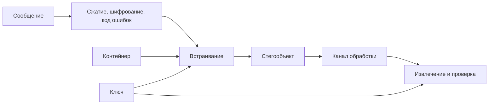

<!-- generated: crypto-stego-course -->
# Цифровая стеганография

## Кратко

Цифровая стеганография (Digital Steganography) скрывает сам факт передачи сообщения внутри цифрового контейнера. В отличие от шифрования, цель состоит не только в недоступности содержания, но и в снижении вероятности обнаружения вложения.

## Зачем это нужно

Цифровая стеганография строит скрытый канал внутри обычного цифрового объекта. Получатель должен извлечь сообщение, а наблюдатель — не отличить стегообъект от нормального контейнера с практически полезной уверенностью. Поэтому алгоритм оценивают как целую систему: подготовка сообщения, выбор мест, модификация, передача и детектирование. Подтверждающие материалы: [The Prisoners' Problem and the Subliminal Channel](https://doi.org/10.1007/978-1-4684-4730-9_5), [Techniques for Data Hiding](https://doi.org/10.1147/sj.353.0313), [Information Hiding — A Survey](https://doi.org/10.1109/5.771065).

## Что нужно знать заранее

- [[Сокрытие информации]]
- [[Основы цифровых изображений]]
- [[Cryptosystem and Security Goals]]

## Основные понятия

| Термин | Простое объяснение |
|---|---|
| Встраиватель | функция, создающая стегообъект |
| Извлекатель | функция восстановления скрытых данных |
| Объём вложения | количество скрытых данных относительно контейнера |
| Канал обработки | все изменения между записью и извлечением |
| Безопасность | трудность статистически отличить контейнер от стегообъекта |

## Как это устроено

Скрытое сообщение распределяется по множеству малых модификаций, каждая из которых должна выглядеть естественно для данного источника изображений. Секретный ключ может выбирать позиции, но он не исправляет плохую статистику изменений. Чем больше битов встраивается, тем заметнее суммарный след.

1. Процедура встраивания выбирает элементы контейнера и кодирует в них биты сообщения.
2. Стеганографический ключ может определять порядок выбора позиций или параметры изменения.
3. Извлечение может быть слепым, когда исходный контейнер не нужен, либо опираться на оригинал.

## Формальная модель

$$
S=E(C,M,K),\qquad \hat M=D(S,K)
$$

**Обозначения и смысл.** Embed принимает контейнер C, сообщение M и ключ K, а Extract использует согласованный ключ для получения оценки M. В слепой схеме исходный C при извлечении не нужен.

$$
P(Detect(S)=1)\rightarrow\min
$$

**Обозначения и смысл.** P_E — средняя вероятность ошибки различения классов при равных априорных вероятностях; P_FA — ложная тревога, P_MD — пропуск стегообъекта. Значение около 1/2 соответствует случайному угадыванию.

## Разобранный пример

Лекция сопоставляет пространственное изменение пикселей и частотное изменение коэффициентов, а нейросетевое встраивание оставляет как обзор двух архитектурных подходов.

1. Подготовить сообщение: добавить длину, контроль целостности, при необходимости шифрование и исправление ошибок.
2. По ключу выбрать допустимые элементы контейнера и исключить области, где изменение создаст аномалию.
3. Встроить биты, контролируя границы значений и число реально изменённых элементов.
4. Передать объект через предполагаемую цепочку обработки.
5. Извлечь сообщение, проверить контрольную сумму и отдельно измерить обнаружимость на независимой выборке.

## Схема

## Дополнительное понимание

Полезно различать безопасность содержимого и безопасность канала. Даже идеально зашифрованные скрытые данные могут быть обнаружены по следам встраивания, а найденный стегообъект можно уничтожить без расшифрования. Обратная ситуация тоже возможна: статистически аккуратное вложение передаёт открытый текст, который раскрывается после извлечения. Поэтому практическая схема сначала сжимает и шифрует сообщение, затем добавляет код исправления ошибок и только после этого встраивает. Форматирование должно быть недвусмысленным: длина, версия и контроль целостности не должны заставлять извлекатель угадывать границы. В исследовательской оценке важна гипотеза источника: камера, редактор и параметры кодека формируют разные распределения. Детектор, обученный на одном источнике, может распознавать источник вместо вложения. Этот эффект называется несовпадением контейнеров и требует отдельной проверки.

## Пояснение и границы применения

Полная система начинается раньше встраивания. Сообщение кодируют, при необходимости шифруют, добавляют контроль целостности и исправление ошибок. Затем ключ задаёт выбор позиций или параметров. Извлекатель должен выполнить операции в обратном порядке и отличить ошибку синхронизации от неверного ключа и повреждения канала. Если формат этих данных не определён, удачный пример на одной строке ещё не является воспроизводимой системой.

Безключевая схема раскрывается вместе с алгоритмом: противник может повторить извлечение. В ключевой схеме секретным остаётся выбор позиций или кодовая последовательность, но сам алгоритм считается известным. Это применение принципа Керкгоффса. Один пароль нельзя непосредственно использовать как генератор позиций без функции выработки ключа, а nonce или идентификатор контейнера не следует повторять, если от него зависит последовательность.

Для оценки нужны парные данные. Чистый контейнер и его стегоизображение сравнивают по искажению, затем проверяют извлечение после ожидаемых преобразований. Обнаружимость измеряют на независимом наборе, причём варианты одного исходника не разделяют между обучением и тестом. Наконец, проверяют неправильный ключ и изменённое сообщение: система должна выдавать явную ошибку, а не случайный правдоподобный текст.

## Рабочий разбор

Для практической проверки разделите систему на источник данных, преобразование, канал и решающее правило. Зафиксируйте единицы измерения, диапазоны и точность промежуточных величин. Термин «Встраиватель» должен иметь одно операционное определение, а «Безопасность» — измеримый критерий. Это не формальность: изменение округления, порядка обхода или представления данных способно дать другой результат при той же формуле.

Проведите три опыта. Первый подтверждает разобранный пример на малых данных, где все шаги можно проверить вручную. Второй меняет один параметр и показывает ожидаемый компромисс качества, устойчивости или сложности. Третий имитирует ошибку «Оценивать метод на тех же изображениях, на которых подбирались параметры.» и должен завершиться контролируемым отказом либо заметным ухудшением метрики. Для каждого опыта сохраните вход, параметры, промежуточные значения и итог.

Вывод формулируйте только в границах испытания. Проверка «Повторить испытание при разных объёмах вложения и ключах.» показывает, переносится ли наблюдение за пределы одного примера. Если результат меняется при новом источнике данных или другой цепочке обработки, это ограничение метода нужно записать явно, а не скрывать усреднённой оценкой.

## Мини-практика

1. Воспроизведите разобранный пример без подсказок и запишите все промежуточные значения.
2. Намеренно смоделируйте типичную ошибку: Использовать ключ только как пароль к очевидному последовательному встраиванию.
3. Проверьте исправленный результат по критерию: Проверять не одну картинку, а репрезентативный набор чистых и стегоизображений.
4. Объясните своими словами главный вывод: Стегосистема включает подготовку, встраивание, канал и извлечение.

## Ограничения и типичные ошибки

- Незаметность для глаза не равна статистической неразличимости.
- Перекодирование, масштабирование, фильтрация и обрезка могут уничтожить вложение; требования к каналу задаются заранее.
- Использовать ключ только как пароль к очевидному последовательному встраиванию.
- Публиковать размер сообщения в предсказуемом незашифрованном заголовке.
- Считать отсутствие визуальных артефактов отсутствием статистического следа.
- Оценивать метод на тех же изображениях, на которых подбирались параметры.

## Что запомнить

- Стегосистема включает подготовку, встраивание, канал и извлечение.
- Секретный ключ не заменяет статистически безопасное правило модификации.
- Безопасность измеряется на распределениях изображений, а не на одном примере.

## Связи

- [[Сокрытие информации]]
- [[Стеганография в пространственной области]]
- [[Стеганография в частотной области]]
- [[Стегоанализ]]

## Самопроверка

1. Какие данные принимают функции встраивания и извлечения?
2. Как ключ может определять выбор изменяемых элементов контейнера?
3. Почему ёмкость, незаметность и устойчивость конфликтуют друг с другом?

> [!answer]- Ответы
> 1. Встраиватель получает C, M и K, а извлекатель — S и K; результатом является оценка сообщения.
>
> 2. Ключ псевдослучайно определяет порядок и набор изменяемых элементов.
>
> 3. Рост ёмкости требует больше изменений, что обычно повышает заметность и может снижать устойчивость.

## Источники

### Материалы курса

- [[Source - Основы криптографии и стеганографии - Лекция 08]], стр. 2–13.
- [[Source - Основы криптографии и стеганографии - Лекция 10]], стр. 14–15.

### Дополнительные источники

- [The Prisoners' Problem and the Subliminal Channel](https://doi.org/10.1007/978-1-4684-4730-9_5) — Gustavus J. Simmons, 1984; научная статья.
- [Techniques for Data Hiding](https://doi.org/10.1147/sj.353.0313) — Walter Bender, Daniel Gruhl, Norishige Morimoto, Anthony Lu, 1996; научная статья.
- [Information Hiding — A Survey](https://doi.org/10.1109/5.771065) — Fabien A. P. Petitcolas, Ross J. Anderson, Markus G. Kuhn, 1999; научная статья.
