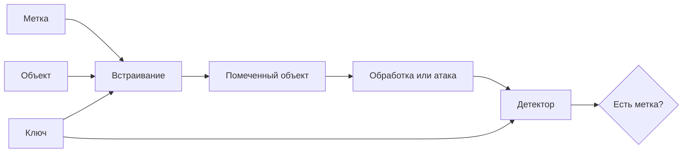

<!-- generated: crypto-stego-course -->
# Цифровые водяные знаки

## Кратко

Цифровые водяные знаки (Digital Watermarking) — это встраивание метки, связанной с объектом, владельцем или событием обработки. В отличие от скрытого сообщения, водяной знак часто проектируется так, чтобы сохраняться после допустимых преобразований контейнера.

## Зачем это нужно

Цифровой водяной знак связывает объект с меткой: идентификатором владельца, номером копии, признаком подлинности или сигналом о модификации. В отличие от тайной переписки, наличие механизма может быть известно. Главное — чтобы проверка соответствовала сценарию применения и ожидаемым преобразованиям. Подтверждающие материалы: [Secure Spread Spectrum Watermarking for Multimedia](https://doi.org/10.1109/83.650120), [Information Hiding — A Survey](https://doi.org/10.1109/5.771065).

## Что нужно знать заранее

- [[Сокрытие информации]]
- [[Метрики качества стеганографии]]
- [[Cryptographic Key Management]]

## Основные понятия

| Термин | Простое объяснение |
|---|---|
| Устойчивый знак | метка, сохраняемая после допустимой обработки |
| Хрупкий знак | метка, разрушаемая при изменении объекта |
| Слепая проверка | проверка без исходного контейнера |
| Детектор | алгоритм принятия решения о наличии метки |
| Порог | граница между положительным и отрицательным решением |

## Как это устроено

Устойчивый знак похож на клеймо, которое должно пережить изменение размера или сжатие. Хрупкий знак похож на пломбу: разрушение важно само по себе. Эти цели противоположны, поэтому нельзя называть один алгоритм хорошим без указания требуемого режима.

1. Метка генерируется из идентификатора или проверяемого утверждения.
2. Встраивание распределяет её по выбранным пикселям или коэффициентам.
3. Проверка оценивает совпадение извлечённой метки с ожидаемой и принимает решение по порогу.

## Формальная модель

$$
S=Embed(C,W,K),\quad accept\iff NCC(W,\hat W)\ge\tau
$$

**Обозначения и смысл.** C — контейнер, W — водяной знак, K — ключ, S — помеченный объект, W-hat — извлечённая метка; tau — порог.

**Условия применения.** В примере NCC=ΣW_i W-hat_i/√(ΣW_i²·ΣW-hat_i²), без вычитания среднего, для ненулевых векторов. Другие нормировки дают другие пороги; принятие метки само по себе не доказывает юридическое авторство.

## Разобранный пример

*Происхождение:* Составленный учебный пример; не экспериментальный результат курса.

**Исходные данные.** Детектор извлёк W-hat=(1,1,0,0); эталон W=(1,1,1,1). Применяется NCC без вычитания среднего, порог tau=0.8.

1. Скалярное произведение W·W-hat=2; квадраты норм равны 4 и 2.
2. NCC=2/√(4·2)=1/√2≈0.7071; сравнить с 0.8.

**Результат.** Детектор не принимает метку: 0.7071<0.8.

**Проверка.** Для неизменной метки NCC=4/√16=1, решение положительное.

**Граница применимости.** При нулевом извлечённом векторе знаменатель ноль: это не NCC=0, а неопределённая статистика; примерная политика — отказ. Смена нормировки требует нового порога.

## Схема

## Дополнительное понимание

Система водяных знаков включает больше, чем пару функций встраивания и проверки. Нужны правила выпуска идентификаторов, хранения ключей, разрешения коллизий и интерпретации отрицательного результата. Слепой детектор удобнее в эксплуатации, но имеет меньше опорной информации. Неслепая проверка может сравнивать с оригиналом, однако требует надёжного доступа к эталону. Для устойчивого знака важно различать обычную обработку и активную атаку: обе меняют сигнал, но атакующий специально ищет преобразование, которое разрушит решение при приемлемом качестве объекта. Сила встраивания не решает проблему бесконечно: после некоторого уровня метка становится заметной или ухудшает полезность. Практический выбор делают по кривой компромисса между качеством, вероятностью обнаружения и устойчивостью.

## Пояснение и границы применения

Водяной знак связывают с объектом или владельцем, поэтому одного успешного извлечения недостаточно. Нужно определить, кто создаёт метку, кто проверяет, может ли проверяющий восстановить исходник и что считается доказательством. В слепой схеме детектор работает без оригинала; в неслепой сравнивает помеченный объект с эталоном. Эти режимы нельзя сопоставлять по одному порогу корреляции.

Объём вложения обычно мал, а сигнал распределяется по множеству отсчётов. Избыточность помогает пережить сжатие и локальное повреждение, но повышает риск заметности и статистического обнаружения. Для идентификатора владельца применяют кодирование ошибок и привязку к ключу; открытая постоянная метка позволяет противнику усреднять несколько объектов и оценивать её структуру.

Испытание строят как матрицу преобразований: JPEG с несколькими качествами, масштабирование, обрезка, шум, фильтрация и их допустимые комбинации. Для геометрических атак отдельно проверяют синхронизацию, потому что знак может физически сохраниться, но детектор будет читать неверные позиции. Порог выбирают на чистых объектах по допустимой частоте ложных тревог, после чего не подстраивают по тестовым помеченным данным.

## Ограничения и типичные ошибки

- Устойчивая метка обычно вносит больше искажений, чем хрупкая.
- Водяной знак не доказывает авторство сам по себе: важны ключ, протокол регистрации и доверенная проверка.
- Считать найденную похожую метку самостоятельным доказательством авторства.
- Подбирать порог на той же выборке, на которой сообщается качество.
- Требовать от хрупкой метки устойчивости или от устойчивой — чувствительности к любой правке.
- Усиливать метку до визуальной заметности без оценки пользы.

## Что запомнить

- Назначение определяет, должна ли метка сохраняться или разрушаться.
- Решение детектора зависит от порога и модели обработки.
- Техническая метка работает только вместе с ключами и процедурой доверия.

## Связи

- [[Сокрытие информации]]
- [[Метрики качества стеганографии]]
- [[Атаки на цифровые водяные знаки]]
- [[Стеганография в частотной области]]

## Самопроверка

1. Чем хрупкий водяной знак отличается от устойчивого?
2. Как BER и NCC характеризуют восстановление метки?
3. Почему наличие водяного знака само по себе не доказывает авторство?

> [!answer]- Ответы
> 1. Хрупкий знак сигнализирует об изменении разрушением, устойчивый должен переживать заданные преобразования.
>
> 2. BER показывает долю ошибочных битов, NCC — сходство исходной и восстановленной меток; формулу NCC нужно фиксировать.
>
> 3. Нужна проверяемая связь метки с автором и историей объекта: метку можно скопировать, заявить чужой ключ или получить ложное срабатывание детектора.

## Источники

### Материалы курса

- [[Source - Основы криптографии и стеганографии - Лекция 08]], стр. 5, 10–18.

### Дополнительные источники

- [Secure Spread Spectrum Watermarking for Multimedia](https://doi.org/10.1109/83.650120) — Ingemar J. Cox, Joe Kilian, F. Thomson Leighton, Talal Shamoon, 1997; научная статья.
- [Information Hiding — A Survey](https://doi.org/10.1109/5.771065) — Fabien A. P. Petitcolas, Ross J. Anderson, Markus G. Kuhn, 1999; научная статья.
