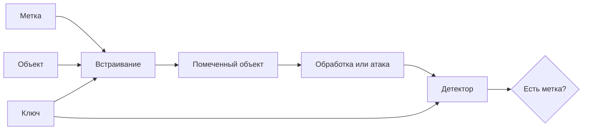

<!-- generated: crypto-stego-course -->
# Цифровые водяные знаки

## Кратко

Цифровые водяные знаки (Digital Watermarking) — это встраивание метки, связанной с объектом, владельцем или событием обработки. В отличие от скрытого сообщения, водяной знак часто проектируется так, чтобы сохраняться после допустимых преобразований контейнера.

## Зачем это нужно

Цифровой водяной знак связывает объект с меткой: идентификатором владельца, номером копии, признаком подлинности или сигналом о модификации. В отличие от тайной переписки, наличие механизма может быть известно. Главное — чтобы проверка соответствовала сценарию применения и ожидаемым преобразованиям. Подтверждающие материалы: [Secure Spread Spectrum Watermarking for Multimedia](https://doi.org/10.1109/83.650120), [Information Hiding — A Survey](https://doi.org/10.1109/5.771065).

## Что нужно знать заранее

- [[Сокрытие информации]]
- [[Метрики качества стеганографии]]
- [[Cryptographic Key Management]]

## Основные понятия

| Термин | Простое объяснение |
|---|---|
| Устойчивый знак | метка, сохраняемая после допустимой обработки |
| Хрупкий знак | метка, разрушаемая при изменении объекта |
| Слепая проверка | проверка без исходного контейнера |
| Детектор | алгоритм принятия решения о наличии метки |
| Порог | граница между положительным и отрицательным решением |

## Как это устроено

Устойчивый знак похож на клеймо, которое должно пережить изменение размера или сжатие. Хрупкий знак похож на пломбу: разрушение важно само по себе. Эти цели противоположны, поэтому нельзя называть один алгоритм хорошим без указания требуемого режима.

1. Метка генерируется из идентификатора или проверяемого утверждения.
2. Встраивание распределяет её по выбранным пикселям или коэффициентам.
3. Проверка оценивает совпадение извлечённой метки с ожидаемой и принимает решение по порогу.

## Формальная модель

$$
S=Embed(C,W,K)
$$

**Обозначения и смысл.** E встраивает метку W в контейнер C с силой alpha и ключом K. Детектор сравнивает статистику rho с порогом tau; выбор порога задаёт баланс ложных тревог и пропусков.

$$
accept\iff NCC(W,\hat W)\ge\tau
$$

**Обозначения и смысл.** BER измеряет долю ошибочных битов восстановленной метки, NCC — нормированное сходство. Их интерпретируют вместе с качеством объекта и условиями обработки.

## Разобранный пример

Курс демонстрирует один водяной знак после JPEG-сжатия с разными уровнями качества и сравнивает результат через BER и NCC.

1. Определить назначение метки и сформировать короткий идентификатор с кодом исправления ошибок.
2. По ключу выбрать коэффициенты или области и встроить метку с заданной силой.
3. Применить ожидаемые операции: JPEG, масштабирование, обрезку или цветокоррекцию.
4. Вычислить статистику детектора или восстановить биты.
5. Сравнить результат с порогом и зарегистрировать параметры обработки, ложные тревоги и качество.

## Схема

## Дополнительное понимание

Система водяных знаков включает больше, чем пару функций встраивания и проверки. Нужны правила выпуска идентификаторов, хранения ключей, разрешения коллизий и интерпретации отрицательного результата. Слепой детектор удобнее в эксплуатации, но имеет меньше опорной информации. Неслепая проверка может сравнивать с оригиналом, однако требует надёжного доступа к эталону. Для устойчивого знака важно различать обычную обработку и активную атаку: обе меняют сигнал, но атакующий специально ищет преобразование, которое разрушит решение при приемлемом качестве объекта. Сила встраивания не решает проблему бесконечно: после некоторого уровня метка становится заметной или ухудшает полезность. Практический выбор делают по кривой компромисса между качеством, вероятностью обнаружения и устойчивостью.

## Пояснение и границы применения

Водяной знак связывают с объектом или владельцем, поэтому одного успешного извлечения недостаточно. Нужно определить, кто создаёт метку, кто проверяет, может ли проверяющий восстановить исходник и что считается доказательством. В слепой схеме детектор работает без оригинала; в неслепой сравнивает помеченный объект с эталоном. Эти режимы нельзя сопоставлять по одному порогу корреляции.

Объём вложения обычно мал, а сигнал распределяется по множеству отсчётов. Избыточность помогает пережить сжатие и локальное повреждение, но повышает риск заметности и статистического обнаружения. Для идентификатора владельца применяют кодирование ошибок и привязку к ключу; открытая постоянная метка позволяет противнику усреднять несколько объектов и оценивать её структуру.

Испытание строят как матрицу преобразований: JPEG с несколькими качествами, масштабирование, обрезка, шум, фильтрация и их допустимые комбинации. Для геометрических атак отдельно проверяют синхронизацию, потому что знак может физически сохраниться, но детектор будет читать неверные позиции. Порог выбирают на чистых объектах по допустимой частоте ложных тревог, после чего не подстраивают по тестовым помеченным данным.

## Рабочий разбор

Для практической проверки разделите систему на источник данных, преобразование, канал и решающее правило. Зафиксируйте единицы измерения, диапазоны и точность промежуточных величин. Термин «Устойчивый знак» должен иметь одно операционное определение, а «Порог» — измеримый критерий. Это не формальность: изменение округления, порядка обхода или представления данных способно дать другой результат при той же формуле.

Проведите три опыта. Первый подтверждает разобранный пример на малых данных, где все шаги можно проверить вручную. Второй меняет один параметр и показывает ожидаемый компромисс качества, устойчивости или сложности. Третий имитирует ошибку «Усиливать метку до визуальной заметности без оценки пользы.» и должен завершиться контролируемым отказом либо заметным ухудшением метрики. Для каждого опыта сохраните вход, параметры, промежуточные значения и итог.

Вывод формулируйте только в границах испытания. Проверка «Для заявления об авторстве проверять управление ключами, регистрацию метки и процедуру разрешения споров.» показывает, переносится ли наблюдение за пределы одного примера. Если результат меняется при новом источнике данных или другой цепочке обработки, это ограничение метода нужно записать явно, а не скрывать усреднённой оценкой.

## Мини-практика

1. Воспроизведите разобранный пример без подсказок и запишите все промежуточные значения.
2. Намеренно смоделируйте типичную ошибку: Считать найденную похожую метку самостоятельным доказательством авторства.
3. Проверьте исправленный результат по критерию: Строить ROC-кривую по множеству помеченных и чистых объектов, а не выбирать порог по одному примеру.
4. Объясните своими словами главный вывод: Назначение определяет, должна ли метка сохраняться или разрушаться.

## Ограничения и типичные ошибки

- Устойчивая метка обычно вносит больше искажений, чем хрупкая.
- Водяной знак не доказывает авторство сам по себе: важны ключ, протокол регистрации и доверенная проверка.
- Считать найденную похожую метку самостоятельным доказательством авторства.
- Подбирать порог на той же выборке, на которой сообщается качество.
- Требовать от хрупкой метки устойчивости или от устойчивой — чувствительности к любой правке.
- Усиливать метку до визуальной заметности без оценки пользы.

## Что запомнить

- Назначение определяет, должна ли метка сохраняться или разрушаться.
- Решение детектора зависит от порога и модели обработки.
- Техническая метка работает только вместе с ключами и процедурой доверия.

## Связи

- [[Сокрытие информации]]
- [[Метрики качества стеганографии]]
- [[Атаки на цифровые водяные знаки]]
- [[Стеганография в частотной области]]

## Самопроверка

1. Чем хрупкий водяной знак отличается от устойчивого?
2. Как BER и NCC характеризуют восстановление метки?
3. Почему наличие водяного знака само по себе не доказывает авторство?

> [!answer]- Ответы
> 1. Хрупкий знак сигнализирует об изменении разрушением, устойчивый должен переживать заданные преобразования.
>
> 2. BER показывает долю ошибочных битов, NCC — сходство исходной и восстановленной меток.
>
> 3. Потому что один и тот же уровень корреляции может давать разные ошибки при разных распределениях чистых объектов.

## Источники

### Материалы курса

- [[Source - Основы криптографии и стеганографии - Лекция 08]], стр. 5, 10–18.

### Дополнительные источники

- [Secure Spread Spectrum Watermarking for Multimedia](https://doi.org/10.1109/83.650120) — Ingemar J. Cox, Joe Kilian, F. Thomson Leighton, Talal Shamoon, 1997; научная статья.
- [Information Hiding — A Survey](https://doi.org/10.1109/5.771065) — Fabien A. P. Petitcolas, Ross J. Anderson, Markus G. Kuhn, 1999; научная статья.
